**Final Submission**

Team Name: Cyber Grape

Proposed Level of Achievement: Apollo 11

Programme: NUS Orbital 2026

Live URL: [novara.vip](www.novara.vip),  [https://novara-flax.vercel.app/](https://novara-flax.vercel.app/)

GitHub: [github.com/Kairon-2005/novara-orbital](https://github.com/Kairon-2005/novara-orbital)

### 📖 [Read the User Playbook →](playbook/index.html)

### Test accounts

| Role | Email | Password | Notes |
| --- | --- | --- | --- |
| **Student** | `demo.cs@novara.vip` | `NovaraDemo2026` | Li Wei — IB → NUS Computer Science |
| **Student** | `demo.biz@novara.vip` | `NovaraDemo2026` | Chen Yixin — A-Level → NUS Business (BBA) |
| **Parent** | `demo.parent@novara.vip` | `NovaraDemo2026` | Li Ming — linked to Li Wei |
| **Admin** | `kaironu@demo.com` | `kaironu1234` | `/admin` — moderation · verification · KB · directory · users |

Both students are seeded with a full journey: AI roadmap, calendar, portfolio assessment,
documents, essay drafts with AI critique, and a contributed admission case with proof.
Regenerate at any time with `npx tsx scripts/seed-demo-users.ts`.

---

# **1. Project Overview**

Novara is a web application built for the NUS Orbital 2026 programme. It serves a specific,
underserved audience: young Chinese international students who relocate to Singapore for
secondary or pre-university education, and their parents, who remain in mainland China and
often speak little English.

For these families, the journey to a "dream university abroad" is fragmented, opaque, and
stressful. Information is scattered across a dozen English-language websites; deadlines are
missed; and parents, who frequently make significant financial sacrifices, have almost no
visibility into how their child is actually progressing. The default alternative is a
留学中介 (study-abroad agency) charging ¥50,000–150,000 for services the family cannot audit.

Novara serves two co-dependent user roles: the Student (a Chinese international student in
Singapore) and the Parent (their family member in mainland China). Every feature is designed
with both roles in mind — students act, parents observe.

Novara turns that journey into a single, guided, visual experience. A student completes a
short profile, receives an AI-generated multi-year academic roadmap, tracks milestones and
achievements, drafts application essays against honest critique, compares programmes on
official statistics, and shares a Simplified-Chinese progress view with their parents, so the
whole family can see progress toward the goal.

The product's north star is captured in one sentence: **Gamify and visualise the process of
"going to your dream university abroad," and let parents see what their kids are doing.**

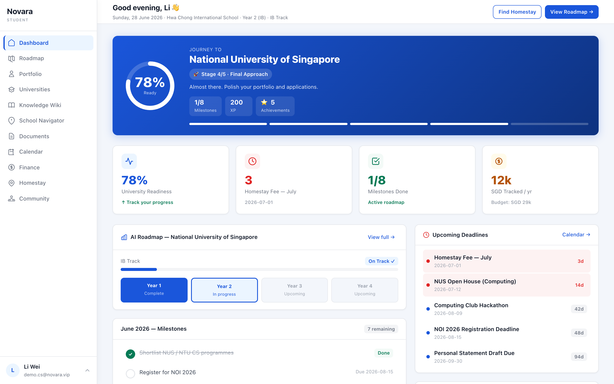

## **1.1 Audience**

* **Students:** AI roadmap, calendar, portfolio assessment, application assistant, essay critique, programme-comparison dashboard, verified admission case library.

* **Parents:** Progress overview, school-notice translation, and a shareable WeChat progress card — delivered in Simplified Chinese.

* **Admins:** Moderation queue, AI-verification oversight, human review, knowledge-base and directory curation.

---

# **2. Motivation**

As a Chinese international student who moved to Singapore at a young age, I personally
experienced the confusion and uncertainty of navigating the local education system. Many
students and parents arrive with a general goal of studying abroad, often without clarity on
the type of school to attend, which curriculum to choose (IB, A-Level, AP, or local), or how
to plan for long-term objectives such as entering university or settling in Singapore.
Information is fragmented, and guidance is scarce, leaving families to make critical decisions
based on limited knowledge.

This project aims to address this gap by providing a comprehensive platform that helps
students and parents understand the education pathways, plan their academic journey, and make
informed long-term decisions — turning uncertainty into actionable plans.

## **2.1 Current Problems**

International students and their families face several compounding challenges when navigating
Singapore's education system:

* **No clear path to a target university.** Advice is generic, English-only, and scattered across more than five different websites, making it difficult for students to form a coherent multi-year plan.

* **Missed deadlines.** DSA windows, exam registrations, and application dates are stored in different places with no centralised reminder system.

* **Language barriers on official notices.** School letters and administrative communications arrive exclusively in English, leaving non-English-speaking parents unable to understand or respond to them.

* **Zero progress visibility for parents.** Parents in China rely on unreliable self-reporting from their children over WeChat, with no independent way to track academic progress.

* **Loss of motivation.** The multi-year journey toward university has no feedback loop or sense of progress, making it easy for students to lose direction.

* **Expensive, unauditable intermediaries.** Families who can afford an agency pay a large sum for essay help, school selection judgement, and a pre-submission safety net — and have no way to verify the quality of what they receive.

* **Untrustworthy peer information.** Forum admission stories are unverifiable, so students calibrate their expectations against anecdotes that may be exaggerated or fabricated.

## **2.2 Our Solutions**

Novara addresses each pain point through a unified platform built around three core pillars,
plus a trust layer that makes peer information dependable:

* **AI Academic Roadmap.** A personalised, multi-year academic plan generated from the student's profile, spanning from the current year to their planned university enrolment year, with Singapore-specific milestones, competitions, and exam deadlines.

* **Tracking System.** An integrated suite of tools including a smart calendar with week and day views, conflict detection, in-app reminders and `.ics` export, a milestone tracker, a secure document vault, and a gamified portfolio system featuring XP, levels, and badges that turns long-term progress into a rewarding experience.

* **Family Connection.** A Simplified-Chinese parent dashboard that mirrors the student's journey, linked via a one-time invite code, alongside an AI-powered translator that converts English school communications into Chinese with a summary and urgency flag, and a tokenised progress card a parent can forward to a WeChat family group.

* **Agency-Replacement Services.** The craft services families normally pay an agency for: essay critique grounded in the student's own record, reach/match/safety positioning verdicts computed from verified outcomes, a pre-submission readiness audit, and a programme dashboard built exclusively from official statistics.

---

# **3. User Stories**

1. As a newly arrived international student from China, I am overwhelmed by the number of school options in Singapore and unsure whether IB, A-Level, or local curriculum suits my goal of entering NUS. With Novara, I can browse and compare different school types and curricula with clear pros, cons, and admission pathways, so that I can make an informed decision without relying on fragmented online searches.

2. As a parent relocating to Singapore with a Primary 5 child, I am unfamiliar with the local education system and worried about placing my child in the wrong school. With Novara, I can filter schools by level, curriculum, and zone, so that I can shortlist options that fit our family's situation before we even arrive.

3. As a Secondary 3 student preparing for JC and university applications, I am unsure which competitions, enrichment programmes, and exams I should prioritise over the next four years. With Novara, I can receive a personalised roadmap with milestones and recommendations based on my profile and target university, so that I can plan strategically instead of reactively.

4. As a student who just switched from a local school to an IB programme, I am worried that I am already behind my peers in terms of academic preparation. With Novara, I can generate a catch-up plan based on my current level and target goals, so that I know exactly what to focus on each month.

5. As a student juggling school exams, CCA commitments, and application deadlines, I often miss important dates because my schedule is spread across multiple platforms. With Novara, I can centralise all my deadlines in one calendar with colour-coded reminders as dates approach, so that I never miss a critical event.

6. As a student with an upcoming university application deadline in three weeks, I am anxious about losing track of time. With Novara, I can see my deadline automatically highlighted with a countdown, so that I feel a clear sense of urgency and can plan my preparation accordingly.

7. As an international student, I frequently need to submit documents like my passport, student pass, and transcripts, but they are scattered across emails and physical files. With Novara, I can securely store and organise all my important documents in one place, so that I can retrieve them instantly whenever needed.

8. As a parent who helps manage my child's paperwork, I find it inconvenient to ask my child to resend files every time I need them. With Novara, I can view and download the documents my child has shared with me, so that I can assist with applications independently.

9. As a Chinese-speaking parent with limited English proficiency, I often receive school notices that I cannot fully understand. With Novara, I can automatically translate school communications into Chinese with a clear summary, so that I can stay informed and support my child without language barriers.

10. As a new international student who just arrived in Singapore, I feel isolated and unsure about day-to-day school life. With Novara, I can read verified admission stories from students who have gone through similar experiences, so that I can get practical advice and feel less alone in my transition.

11. As a student who successfully gained admission to NUS from an IB background, I want to give back to the community. With Novara, I can share my experience and verified proof of admission with younger students going through the same journey, so that they can benefit from what I learned.

12. As a student applying to competitive universities, I need to keep track of my academic achievements, competition results, and leadership experiences over several years. With Novara, I can organise all my records in a structured portfolio and track my readiness score, so that I have everything ready when application season arrives.

13. As a Secondary 4 student who has never systematically tracked my achievements, I realise I have forgotten many activities I participated in over the past two years. With Novara, I can retroactively log my achievements with dates and descriptions, so that I can reconstruct a complete picture of my profile.

14. As a parent, I often feel out of touch with my child's academic progress and find it difficult to have meaningful conversations about their preparation. With Novara, I can view a simple summary of my child's progress and upcoming deadlines on the parent dashboard, so that I can stay informed and supportive without being intrusive.

15. As a student applying to NUS or NTU, I want to read real admission cases from students with similar backgrounds before I finalise my application strategy. With Novara, I can browse the verified admission case library filtered by curriculum and target programme, so that I can calibrate my expectations against real outcomes.

16. As an admin responsible for the platform's knowledge base, I need to review user-contributed content and verify AI decisions. With Novara's admin panel, I can access the moderation queue, override AI verification decisions, mark a case as human-reviewed, and manage the directory, so that the platform maintains high content quality and trust.

17. As a student who has received an offer from a university, I want my case to be treated as trustworthy by others in the community. With Novara, I can upload proof of my admission outcome, have it cross-checked by AI, and verify my school email address to earn a higher trust badge, so that other students can rely on my story.

18. As a student writing my personal statement for the first time, I have no idea whether my draft is strong or generic, and I cannot afford an agency to review it. With Novara, I can get structured critique on structure, specificity, and clichés — cross-referenced against my own recorded achievements — so that I can improve my own writing rather than having it written for me.

19. As a student with five target universities, I do not know which are realistic and which are long shots. With Novara, I can see a 冲刺/匹配/稳妥 verdict on each target computed from verified admission outcomes and my own assessment, so that I can build a balanced application list instead of guessing.

20. As a student two weeks from a submission deadline, I am terrified I have forgotten a required document. With Novara, I can run a readiness check that cross-references my application plan against the documents I have actually uploaded and the deadlines on my calendar, so that I know exactly what is still missing before I submit.

21. As a student deciding between NUS Computer Science and NTU Computer Science, I want to compare them on facts rather than reputation. With Novara, I can view a dashboard of official statistics — QS and THE rankings, graduate median salary, employment rate, and official curriculum links — with a source citation on every figure, so that I can justify my choice.

22. As a student reading a community case that claims an impressive offer, I want to know how much to trust it. With Novara, I can see a tiered trust badge showing whether the case was AI-verified, backed by a verified school mailbox, or confirmed by a human reviewer, so that I can weight the information appropriately.

23. As a parent who wants to share good news with relatives, I want to show my extended family how my child is progressing without giving them access to private records. With Novara, I can generate an expiring, revocable link to a Chinese progress card and forward it to our WeChat family group, so that relatives see the journey but never the sensitive details.

24. As a student whose English is stronger than my parent's, I sometimes need to look at the parent view to explain something, and my parent occasionally wants to practise reading in English. With Novara, either of us can switch the entire interface between English and Chinese from the account menu, so that neither of us is locked into one language.

---

# **4. Scope of Project**

Novara is a full-stack bilingual web application organised around three core product pillars,
with a fourth community-and-knowledge pillar and a fifth agency-replacement pillar completed
for the final milestone.

The first pillar is **AI Roadmap & Tracking**. After a structured onboarding form, the
student's profile is sent to a large language model (Qwen) which returns a structured,
multi-year roadmap. Each year contains concrete, Singapore-specific milestones — real exam
names such as A-Level and IB, real competitions such as SMO and SBO, and real deadlines such
as the DSA window. Students track milestones, earn XP, and level up in a gamified portfolio.

The second pillar is **School Navigation**. This provides a curated school directory covering
primary school through university, filterable by level, curriculum, zone, and free-text
search, for students who must choose a school before university applications are even
relevant.

The third pillar is **Family Connection**. This delivers a Simplified-Chinese parent dashboard
that mirrors the student's journey, linked via a one-time invite code; an AI communication
translator that converts English school notices into Chinese with a summary and urgency flag;
and tokenised progress sharing designed for WeChat.

The fourth pillar is **Community & Knowledge**: the verified admission case library, a tiered
trust system, the admin panel, and the knowledge wiki backed by Qdrant vector search.

The fifth pillar is **Agency Replacement**: the Essay Studio, positioning verdicts,
submission-readiness checks, and the official-statistics programme dashboard — the services a
family would otherwise pay a 留学中介 to provide.

## **4.1 Final Feature Status**

**Implemented:** School Navigator (real curated directory); AI Academic Roadmap Planner (KB
grounding, preview-then-adopt, post-success quota accounting); Smart Calendar (month/week/day
views, event editing, start/end times, conflict detection, reminders, `.ics` export); My
Documents (AI extraction and classification, per-document parent sharing); Parent Support &
Translation Tools (PDF upload + OCR); Portfolio & Achievement Tracker (five-dimension AI
assessment); University Application Assistant (link/paste/upload → plan → calendar push);
Positioning Verdicts (选校定位); Submission Readiness Check (申请就绪检查); Essay Studio (文书工作室)
(feedback-only critique); Programme Comparison Dashboard (项目对比, official statistics with
per-figure provenance); Verified Admission Case Library (AI verification, votes, saves,
notifications, pen names, WeChat sharing); Tiered Trust Badges (可信度分级); Proof Forensics
(hash-based duplicate detection, PDF metadata heuristics); School-Email Verification (学校邮箱验证); Knowledge Wiki (Qdrant hybrid retrieval); Admin Panel (moderation, verification
override, human review marking, KB management, directory CRUD, user/role management); Parent
Dashboard; Progress Sharing (分享申请进度; tokenised, expiring, revocable public card);
full bilingual interface with per-role default language and live switching; AI cost guard
(per-user per-feature daily caps with retry).

**Deliberately out of scope:** essay ghostwriting (the system critiques but never drafts —
see §12.8); email as a communication channel (used only for one-time school-mailbox
verification codes — see §12.5); reputation or karma scoring in the community; and identity
verification beyond mailbox control (see §17).

---

# **5. Features**

## **Feature 1 — School & Curriculum Navigator**

The Navigator is the entry point for a student who has not yet chosen a school. It presents a
curated directory of Singapore institutions spanning primary school, secondary and
international schools, junior colleges, polytechnics, and universities, each with curriculum,
zone, indicative annual fees, highlights, address, and a link to the official site.

Students filter by level, curriculum (IB, A-Level, AP, O-Level, Local), and zone, or search
free-text across name, area, and description — for example "IB near Holland Village". The
directory is backed by a real database table curated through the admin panel, so listings are
maintained as data rather than hardcoded, and the filtering logic is a pure, unit-tested
function.

The directory is populated from official sources rather than by hand:

```bash
npm run schools:ingest
```

pulls MOE's *General information of schools* dataset from data.gov.sg (every primary,
secondary, junior college and centralised institute) and merges it with a curated list of the
autonomous universities, polytechnics, ITE colleges, and major international schools that the
MOE feed does not cover — around 370 institutions in total. Each is geocoded through
[OneMap](https://www.onemap.gov.sg), Singapore's national mapping API, and coordinates are
cached on disk so re-ingests are near-instant. Rows are upserted on `slug`, so the command is
idempotent and safe to re-run when MOE refreshes the dataset.

Those coordinates power **Sort by distance from me**: the browser's Geolocation API supplies
the student's position, and the great-circle distance to each school is computed in the
client, so a location never leaves the device. Cards show the distance, the nearest MRT
station from the MOE feed, and a map deep-link built from the geocoded coordinates rather
than a name search that could land on the wrong campus.

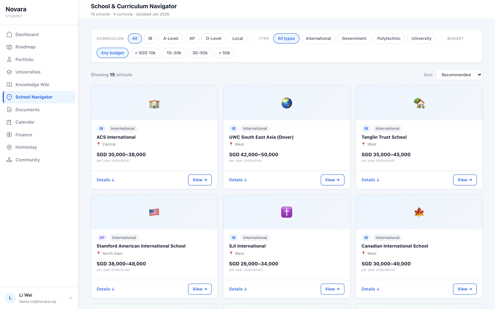

## **Feature 2 — AI Academic Roadmap Planner**

The student completes a structured onboarding profile — current year, school, curriculum,
target university and programme, intended enrolment year, interests, budget, and English
level. That profile is sent to Qwen, grounded with retrieved context from the knowledge base
for NUS and NTU, and returns a multi-year plan broken down by year and month.

Milestones are concrete and Singapore-specific: real exam sittings, real competitions (SMO,
SBO, NOI), and real application windows such as the DSA period. The student reviews the
generated plan in a preview modal and only persists it by clicking Adopt, at which point the
previous roadmap is archived atomically. Completed milestones award XP and feed the gamified
journey card.

Generation runs under a freemium quota of ten free generations per calendar year. The credit
is consumed **only after a generation succeeds**, so a transient AI timeout or a malformed
response never costs the student an allowance.

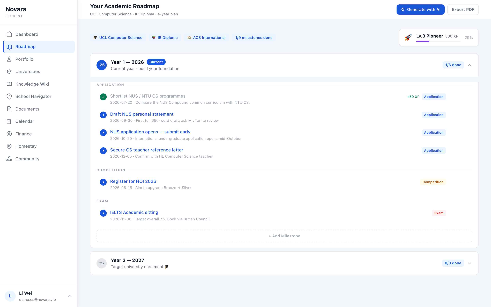

*The preview modal — milestones are reviewed and only persisted on Adopt, so regeneration has no side effects:*

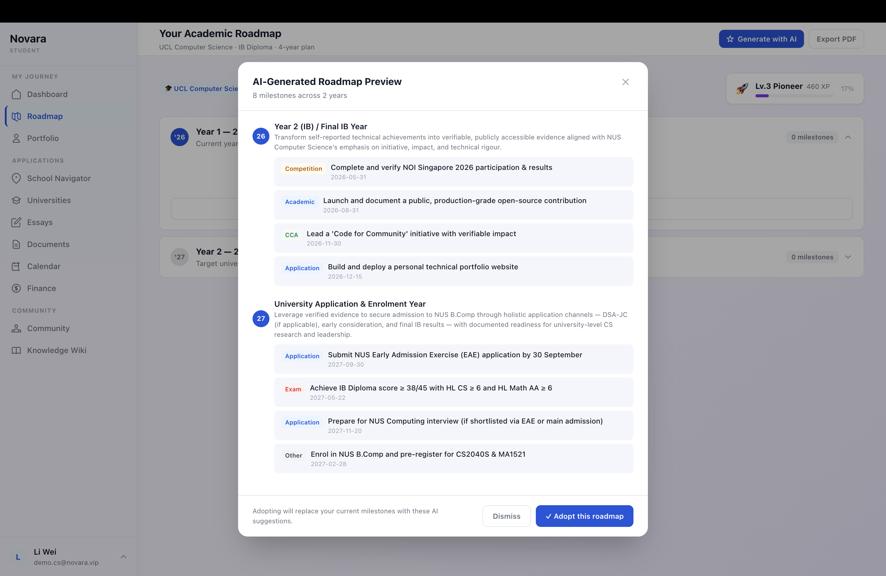

## **Feature 3 — Smart Calendar & Deadline Tracker**

All deadlines converge on one timeline: AI-generated roadmap milestones, application-plan
deadlines pushed from the Application Assistant, finance due dates, and manually created
personal events. Events are colour-coded by type and can be created, edited, and deleted
inline.

The calendar offers month, week, and day views. Week and day views lay events out on an hourly
grid; clicking an empty slot pre-fills the new-event form with that date and time. When a new
event overlaps an existing one, the form warns about the specific conflict and requires
explicit confirmation to proceed. A reminder banner surfaces upcoming deadlines within thirty
days, and the whole calendar exports to `.ics` for Google Calendar or Apple Calendar.

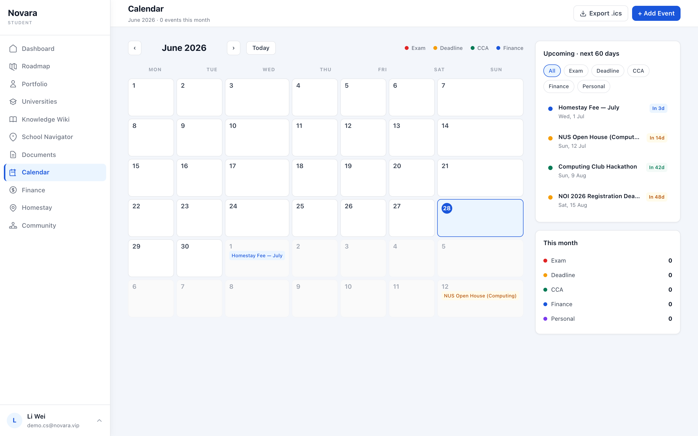

## **Feature 4 — My Documents**

Students upload transcripts, report cards, certificates, passports, visas, and application
documents into a private Supabase Storage bucket. Uploaded files are processed in the
background: text is extracted with `pdf-parse` for PDFs or `tesseract.js` OCR for images, and
the AI classifies the document by type and assesses its relevance to the student's
application profile.

Each document can be individually shared with the linked parent, who receives read access
through a signed URL that expires after a configurable window. Nothing is shared by default —
sharing is always an explicit per-document action by the student.

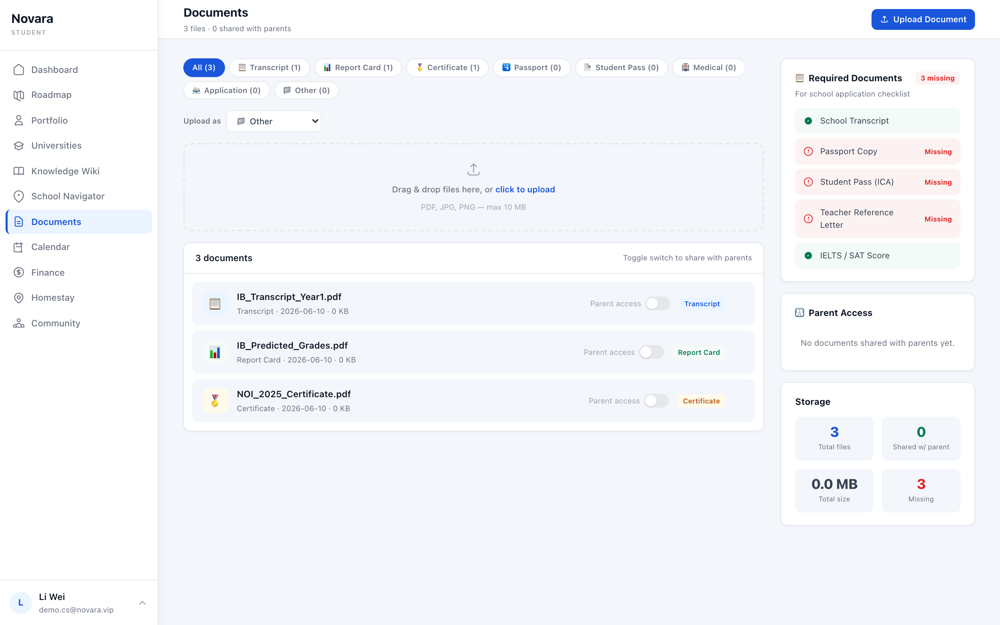

## **Feature 5 — Parent Support & Translation Tools**

A parent (or the student on their behalf) uploads an English school notice as a PDF, an image,
or pasted text. The system extracts the text — OCR included for photographed letters — and
sends it to Qwen, which returns a full Simplified Chinese translation, a two-sentence Chinese
summary, and a category and urgency assessment. Both the original and the translation are
stored, so the parent can read either.

The write path is authorisation-hardened: the target student is derived from the
authenticated session (a student writes their own record; a parent writes their linked
child's), never from a client-supplied identifier.

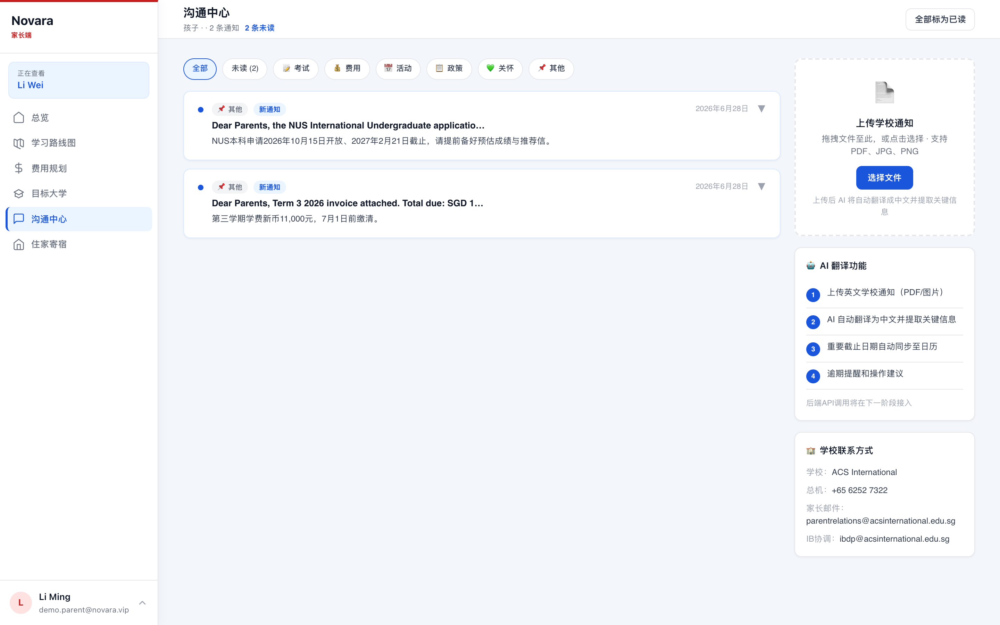

## **Feature 6 — University Application Assistant**

For each target university, the assistant produces a structured application plan: the
application window, every dated deadline, and a document checklist. Rather than relying on
model memory, the student supplies the official source — a link, pasted page text, or an
uploaded PDF or screenshot. The system fetches the page through a tiered strategy (`impit`
with browser fingerprinting, then Jina Reader for JavaScript-rendered pages, then manual
paste/upload), and the plan records the sources it was built from.

Plans are marked *verified* when grounded in an official page or the knowledge base, and
explicitly *unverified* when derived from model knowledge alone, so the student always knows
how much to trust the output. Proposed deadlines are previewed, then pushed to the calendar
idempotently — syncing twice never creates duplicates.

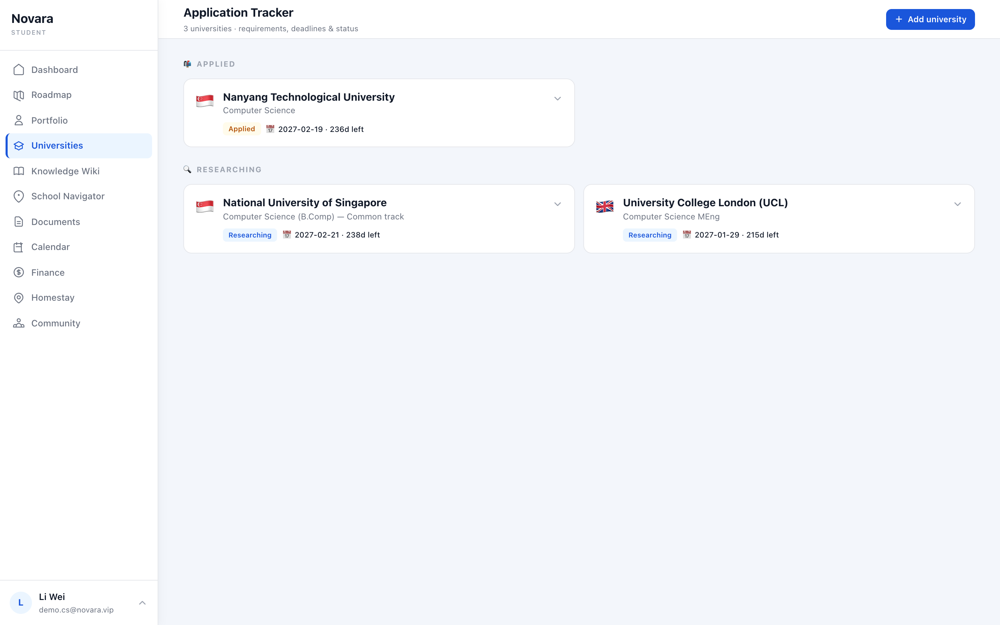

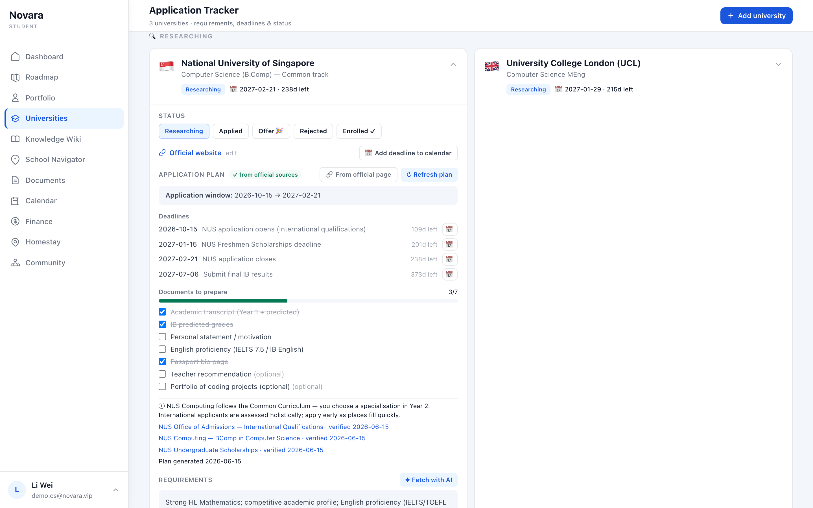

## **Feature 7 — Positioning Verdicts (选校定位)**

Each target university carries a verdict — **Reach** (冲刺), **Match** (匹配), or
**Safety** (稳妥) — replacing the "based on your profile…" judgement an agency sells. The verdict is computed
from two signals Novara actually holds: verified admission outcomes at that institution from
the case library, and the student's own five-dimension portfolio assessment.

The logic is deliberately conservative and is locked by unit tests. With fewer than three
decided verified cases and no assessment, it returns *insufficient data* rather than
guessing. It will **never** label a target "safety" on the strength of a self-assessment
alone — that claim requires real outcome evidence. Each verdict displays the evidence behind
it: the number of verified cases, the offer rate, and comparable admitted backgrounds.

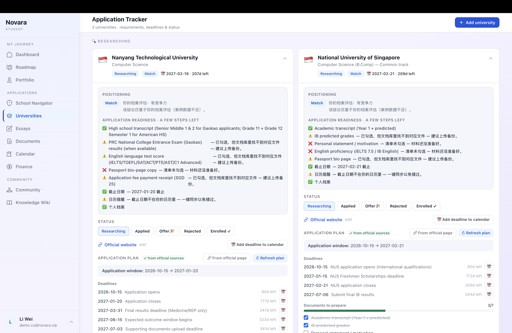

*Both targets read Match on assessment alone, and the panel says so explicitly — "该结论仅基于你的档案评估（案例数据不足）" — rather than implying the verdict is backed by outcome data it does not have.*

## **Feature 8 — Submission Readiness Check (申请就绪检查)**

The safety net an agency provides on submission day, rendered as a per-target audit. The check
cross-references the application plan against what the student has actually done: every
required checklist document must be both ticked off **and** present as a real uploaded file;
the deadline must still be open and mirrored on the calendar; the profile fields the
application needs must be complete; and a plan not grounded in an official page raises a
caution.

Missing items block readiness; warnings inform without blocking. The result is a plain
verdict — "✅ 可以提交" or an explicit list of what remains. The entire check is a pure
function with no AI involvement, so it is deterministic, instant, and free.

The readiness panel is visible in the screenshot above: ✅ marks a requirement satisfied,
⚠️ a warning (checked off but no matching upload, or a deadline missing from the calendar),
and ❌ a blocker.

## **Feature 9 — Essay Studio (文书工作室)**

The single largest expense at a study-abroad agency is essay help, and it is also where
outsourcing does the most damage: universities increasingly detect ghostwritten and
AI-generated text. Novara takes the defensible position — **it critiques, it never writes.**

The student drafts in an autosaving editor alongside the university's actual prompt, optionally
linked to a target. On request, the AI returns structured critique: an honest overall read,
observations on structure, quoted generic claims with concrete replacements, flagged clichés,
ordered revision priorities, and — most valuably — **evidence alignment**, cross-referencing
the draft against the student's own recorded achievements ("you claim leadership but never
mention the SASMO team captaincy in your records").

The no-ghostwriting rule is enforced twice: the prompt forbids drafting prose, and the
response normaliser structurally strips any rewritten-text field and truncates
prose-length bullets. That rule is asserted by a unit test, so it cannot regress silently.
Every round of feedback is stored with a snapshot of the draft it critiqued, so improvement
over time is visible.

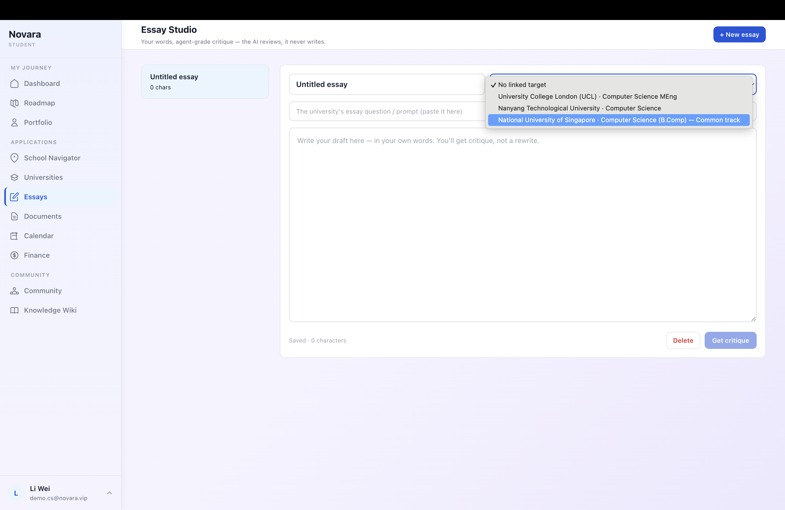

*A draft can be linked to a specific application target, so critique is written against that
programme's expectations.*

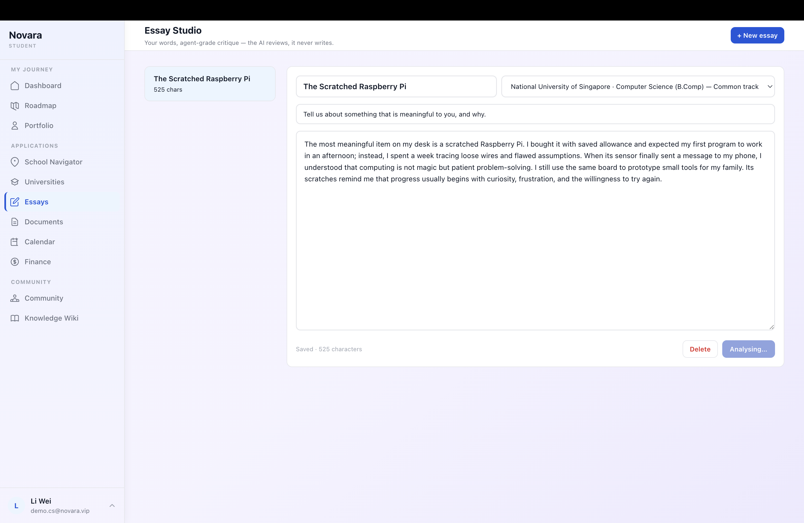

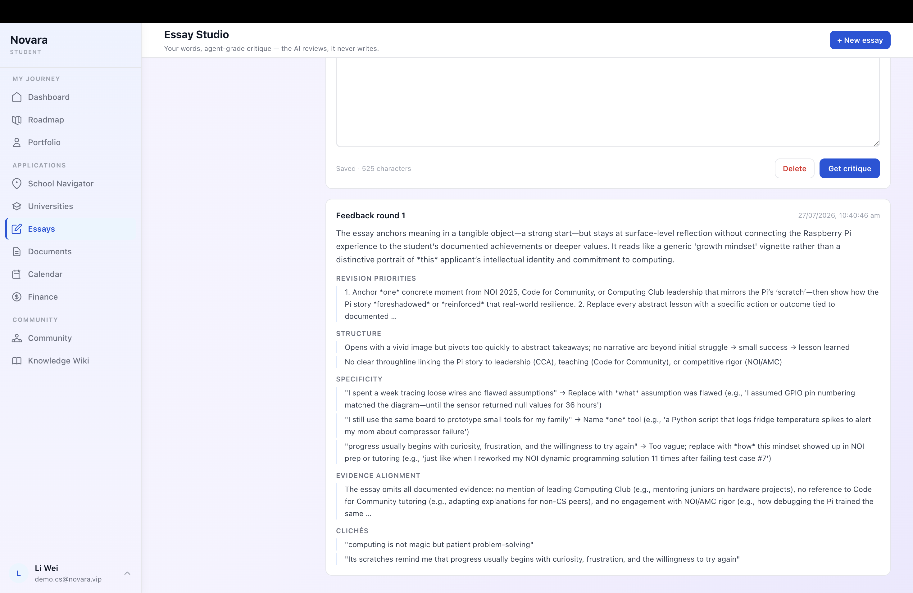

*A full critique round. Note the Evidence Alignment section: the AI cross-references the draft
against the student's actual records — the Computing Club leadership, Code for Community
tutoring, and NOI/AMC results — and names what the essay omitted. No sentence of the essay is
written or rewritten for the student.*

## **Feature 10 — Programme Comparison Dashboard (项目对比)**

Choosing *which* university–programme pair to target is a decision students routinely make on
reputation alone. This dashboard replaces reputation with **official statistics only**.

For each pair it presents the QS World University Ranking, the QS subject ranking, the Times
Higher Education ranking, the median gross monthly starting salary and employment rate from
the Ministry of Education Graduate Employment Survey, and direct links to the official
curriculum page and indicative grade profile. The table sorts by salary, employment rate,
subject rank, or university rank, and a single click (设为目标) turns any row into a tracked application
target.

The provenance rule is absolute: **every figure carries a numbered footnote linking to its
source, with the edition year, and no number is ever AI-generated.** Where a statistic could
not be verified from an official source it is stored as null and rendered as “no data” (暂无数据) rather
than estimated — two such gaps are visible in the current dataset. A methodology note explains
the GES employment definition so the numbers cannot be innocently misread.

> *Screenshot pending — see [Screenshots](#screenshots).*

## **Feature 11 — Verified Admission Case Library**

The Admission Case Library is a community repository of real admission outcomes. What
distinguishes it from a forum is the verification layer: when a student submits a case, they
upload proof — an offer letter, transcript, or test-score report. The proof is extracted with
`pdf-parse` or `tesseract.js`, and the text is cross-checked by AI against the student's
claimed institution, programme, result, and year. Only corroborated cases earn a badge, feed
the knowledge base, and count toward positioning statistics.

The library is structured and queryable rather than a chronological feed: students filter by
institution, programme, curriculum route, result, level, and year, and see aggregate
positioning statistics — offer rate and comparable admitted backgrounds — computed over the
verified subset only. Social features include upvote/downvote (顶/踩) voting, bookmarking (收藏), in-app
notifications, comments, and optional pen names. Cases are anonymous by default, and verified
cases can be shared to WeChat as an anonymised page with a QR code.

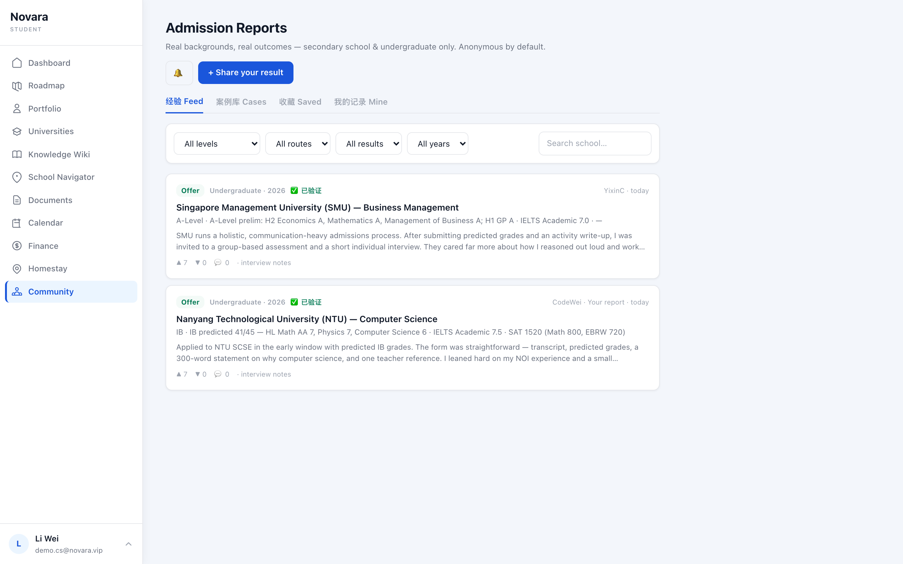

*Submitting a case: proof is uploaded for auto-fill and private cross-checking, and reports are anonymous by default.*

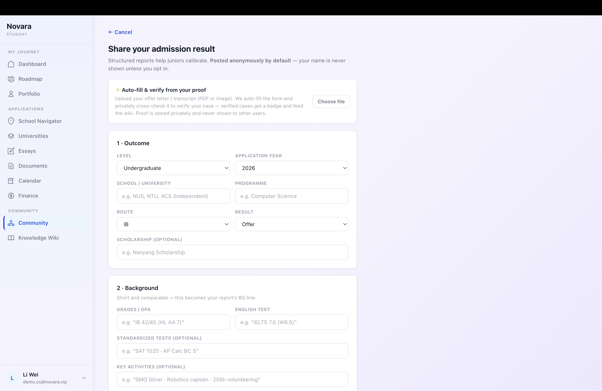

## **Feature 12 — Tiered Trust & Proof Forensics (可信度分级)**

A single "verified" badge cannot express *how* a case was verified, so trust is displayed as a
tier:

| Tier | Meaning |
| --- | --- |
| 🛡 **Human-reviewed** (人工复核) | AI-verified **and** confirmed by a human reviewer in the admin panel |
| 🎓 **Email-verified** (邮箱验证) | AI-verified **and** the author proved control of a mailbox at that same university |
| ✅ **Verified** (已验证) | The uploaded evidence corroborates the claim (AI cross-check) |
| Unverified (未验证) / ⚠️ Mismatch (信息不一致) | No corroborating evidence, or evidence that contradicts the claim |

Two mechanisms raise the cost of faking. **Proof forensics:** every uploaded file is
SHA-256 fingerprinted, so the same document backing a *different* author's case forces the
case to mismatch (信息不一致) — the recycled-offer-letter scam fails. PDF metadata heuristics flag
image-editor producers (Photoshop, Canva) and creation dates outside the admission cycle, and
route those submissions to human review. Critically, forensics can only *lower* trust, never
raise it, and absent metadata is never treated as suspicious.

**School-email verification (学校邮箱验证):** a document can be forged; control of a university
mailbox cannot. Students verify a student address at NUS, NTU, SMU, SUTD, SIT, or SUSS with a
one-time six-digit code, which upgrades their cases at that institution to the email-verified (邮箱验证) tier.
The flow is rate-limited (three sends per day, five attempts, fifteen-minute expiry) and codes
are hashed bound to the user account.

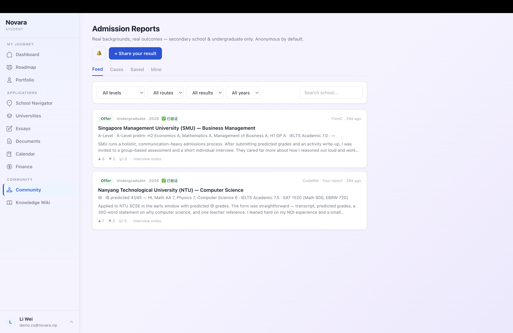

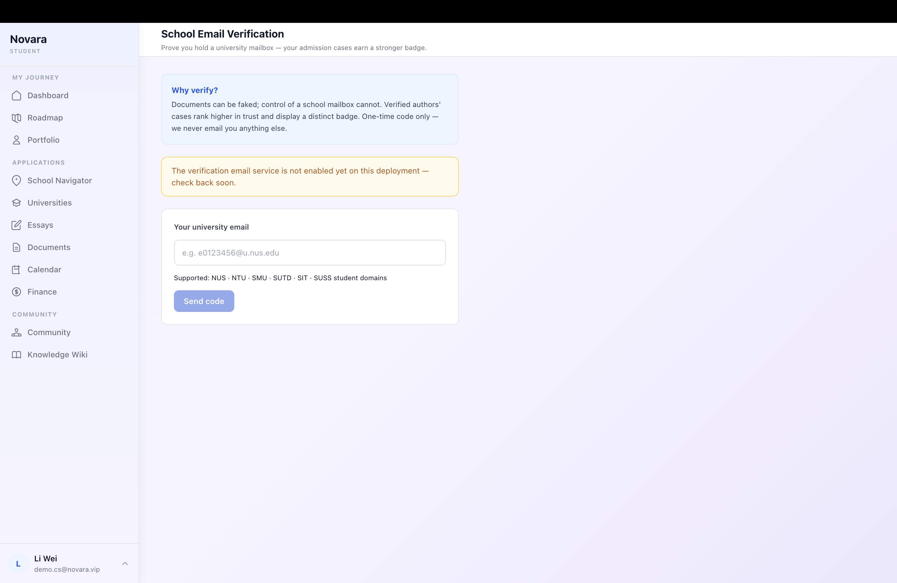

## **Feature 13 — Knowledge Wiki**

The wiki is a curated, searchable corpus of NUS and NTU admissions knowledge, and it is the
same source the AI retrieves from when generating roadmaps and requirement lookups — so what
the student can read is exactly what the AI can cite. Retrieval is hybrid, combining dense
semantic vectors with lexical matching in a single Qdrant query.

The corpus grows from two directions: admins ingest and curate official pages, and verified
community cases are automatically ingested in anonymised form, so real outcomes improve future
AI answers.

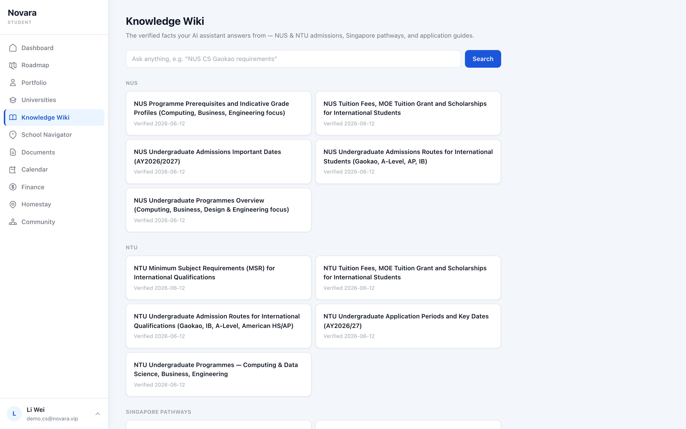

## **Feature 14 — Portfolio & Achievement Tracker**

Students log achievements by category — competition, academic, CCA, volunteer, award, other —
each awarding XP that drives a gamified level progression from Newcomer through Explorer,
Pioneer, Scholar, and Champion, with unlockable badges.

The AI assessment scores the student across five admission-relevant dimensions: Academic
Strength, Programme Fit, Evidence Portfolio, Communication & Storytelling, and Initiative &
Impact. Each dimension returns a score, a level, reasoning, strengths, gaps, and suggested
actions, which flow into the dashboard readiness card, the roadmap generator, and the
positioning verdicts. When no assessment exists, the interface says so plainly rather than
displaying a synthesised score.

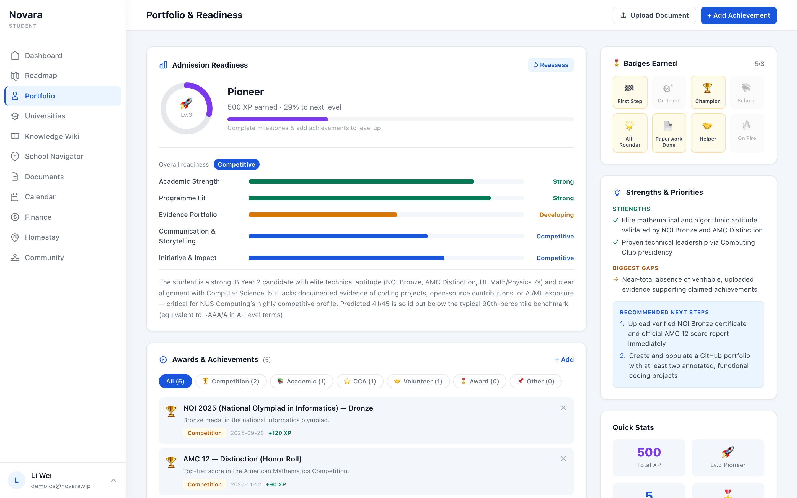

## **Feature 15 — Finance Tracking**

Students and parents track school fees, homestay payments, insurance, and examination fees
alongside a personal expense log and monthly budget targets. Fees carry status — paid, pending,
or overdue — and marking a fee paid or logging an expense persists immediately, so the parent's
finance view always reflects reality. The parent view converts SGD to CNY for family
budgeting.

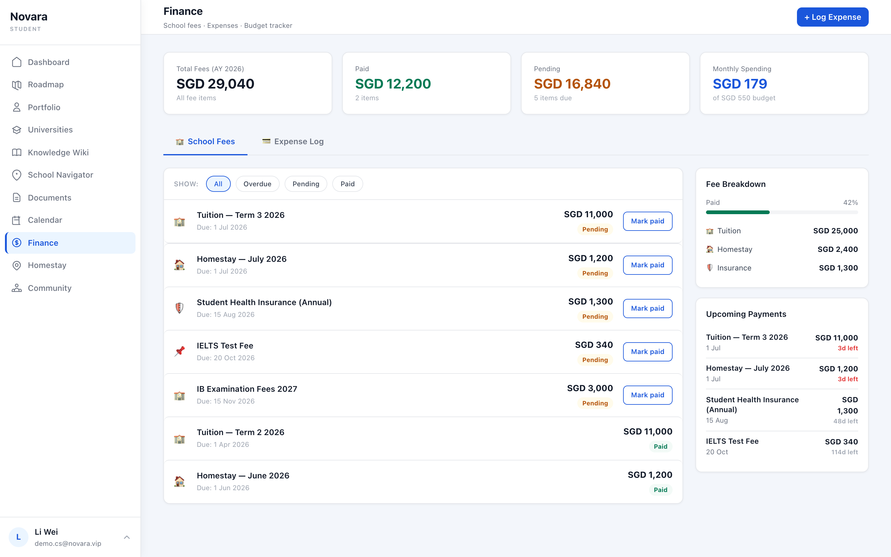

## **Feature 16 — Parent Dashboard**

The parent-facing interface is delivered in Simplified Chinese by default. After the student
shares their six-digit invite code, the parent creates a linked account and sees the child's
journey card, readiness assessment, milestone progress, upcoming deadlines, recent
achievements, translated school communications, target universities with application statuses,
and the finance summary.

The parent dashboard is a hard product requirement, not a nice-to-have: the target parent
users are typically located in mainland China, communicate primarily via WeChat, and have
limited English proficiency. Parent access is read-only over the child's records, enforced at
the database level rather than in the UI.

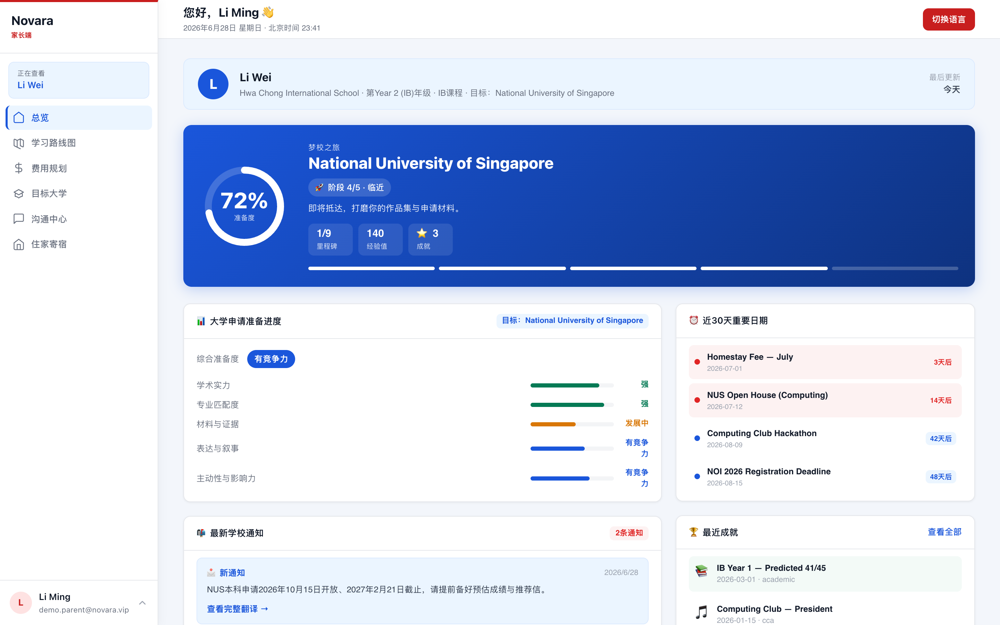

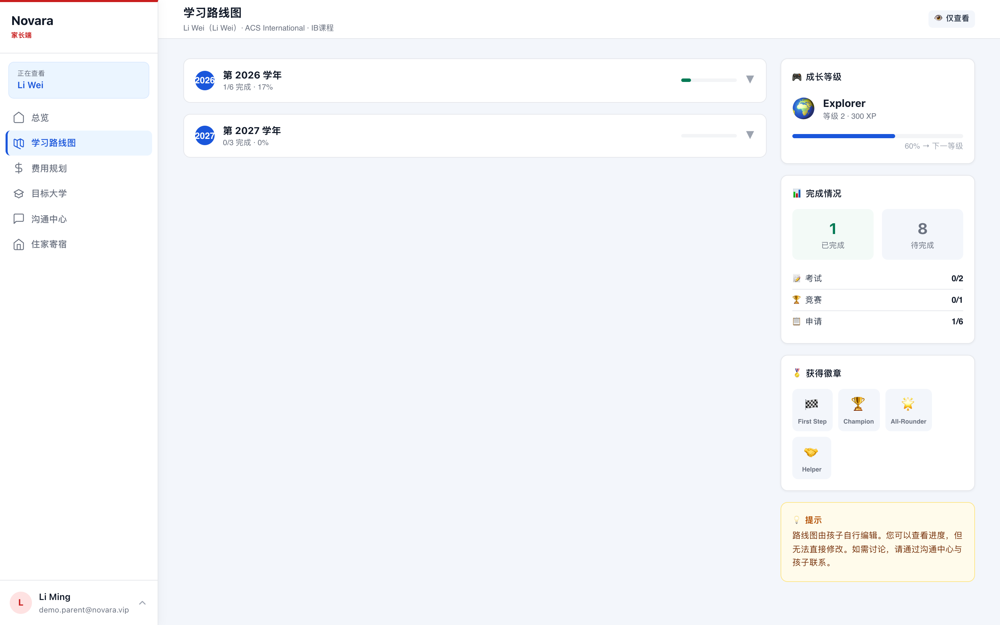

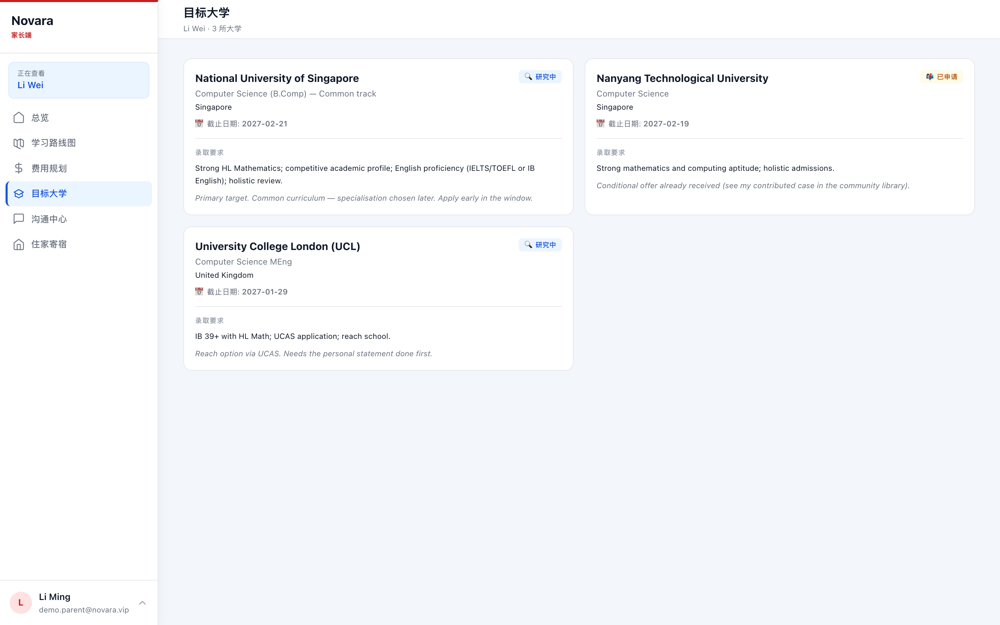

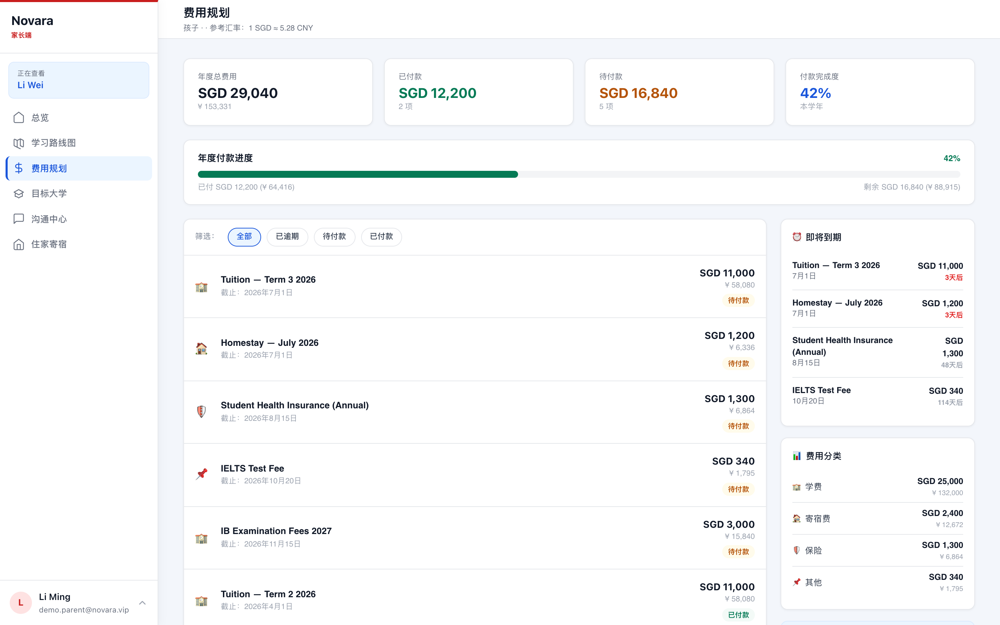

## **Feature 17 — Progress Sharing (分享申请进度)**

Extended family in China ask how the child is doing, and the parent's only options are
screenshots or nothing. This feature gives them a proper answer: the parent generates a
tokenised link and QR code to a mobile-first Simplified-Chinese progress card, sized for the
WeChat in-app browser, and forwards it to the family group.

The card requires no login. Its scope is deliberately coarse: display name, target
universities with statuses, milestone completion counts, journey stage, readiness *level*, and
upcoming deadline titles. It never exposes grades, dimension scores, assessment reasoning,
documents, finances, or communications — a restriction asserted by a unit test on the public
projection. Links expire after seven days, can be revoked at any time, and the page is marked
`noindex`.

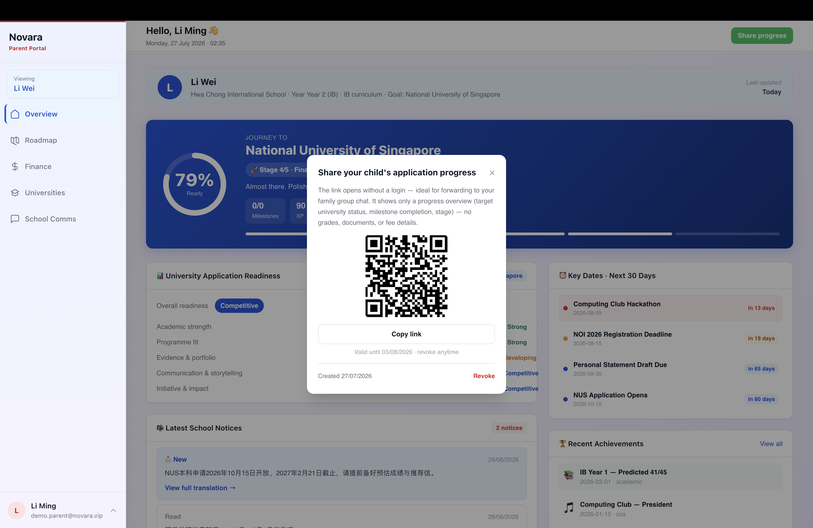

## **Feature 18 — Bilingual Interface**

Every page in the application is bilingual. Student surfaces default to English and parent
surfaces to Simplified Chinese — matching who actually uses each — and either user can switch
the entire interface from the account menu in the sidebar. The choice persists for a year, so
a parent who prefers English keeps it, and a student who wants to show something to a
Chinese-speaking relative can flip instantly.

Copy lives in a per-page dictionary next to the markup that renders it, so a page and its
translations are always modified together.

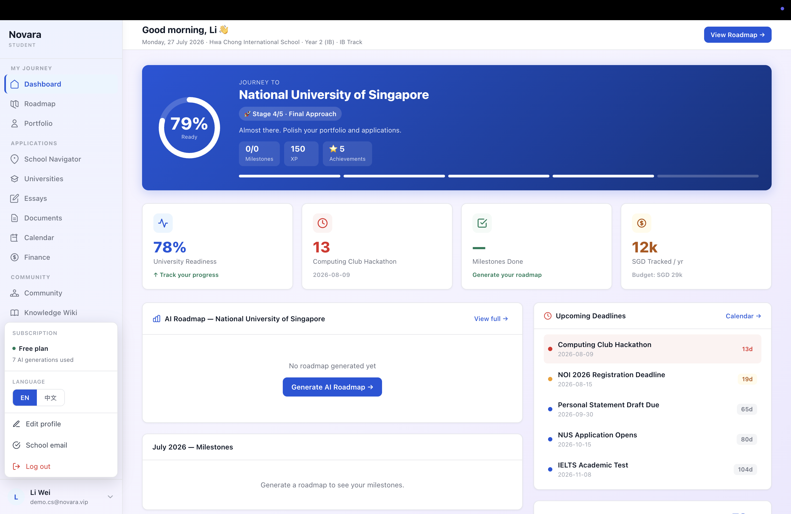

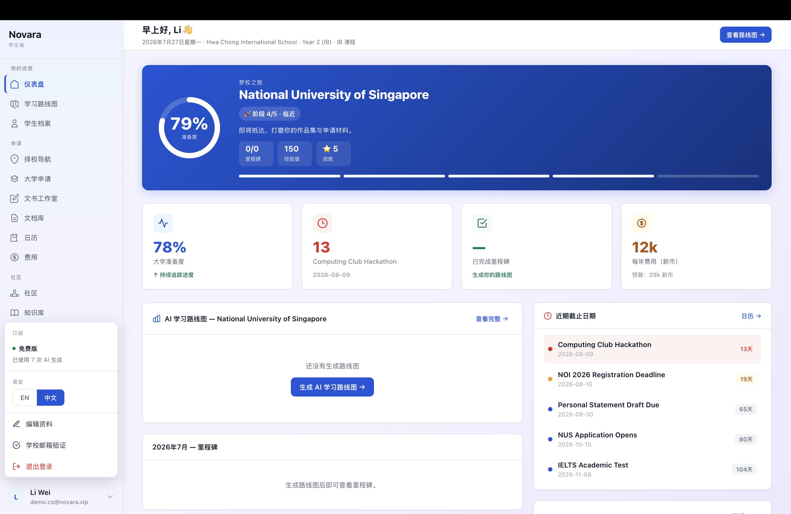

*The same surface in both languages — switched from the account menu, persisted per user.*

## **Feature 19 — Admin Panel**

A `role:admin` control room for the curation and moderation the platform's trust model
depends on:

* **Moderation queue:** review reported community content and approve, flag, or remove it.
* **Verification oversight:** inspect the AI's verdict alongside the claim and the extracted evidence, override it, and mark a case human-reviewed (人工复核) to grant the top trust tier.
* **Knowledge base:** ingest and refresh corpus documents, and review user-contributed pages before they are shared.
* **Directory:** CRUD for the school directory that powers the Navigator.
* **Users:** user and role management, including promoting an admin.

> *Screenshot pending — see [Screenshots](#screenshots).*

## **Feature 20 — AI Cost Guard**

Every AI-backed feature runs behind a guard that enforces a per-user, per-feature daily cap,
retries once on transient upstream failures (rate limits, 5xx, timeouts), and fails loudly if
the API key is missing. Usage is recorded only on success, so a failure never costs a student
an allowance. Counters live in a table that users can read but never write, so a cap cannot be
reset from the browser.

### Screenshots

All images in this document live in `public/screenshots/` and are captured against the seeded
demo accounts listed at the top of this README.

Two screens are described but not yet illustrated. To add them, capture at desktop width,
signed in as the account listed, and save under the given filename — the placeholders will
resolve automatically:

| File to add | What to capture | Signed in as |
| --- | --- | --- |
| `compare.png` | The comparison tab (项目对比) — the statistics table with its numbered source footnotes | `demo.cs@novara.vip` → Universities → Compare |
| `admin-verification.png` | The verification queue showing the “mark as human-reviewed” (标记人工复核) action | `kaironu@demo.com` → `/admin/verification` |

A further note on currency: the screenshots for the dashboard, navigator, roadmap timeline,
universities list, calendar, portfolio, documents, finance, community, wiki, and the five
parent-portal pages were captured before the final visual theme landed. They show the correct
features and layout, but not the current blue-purple gradient styling; the newer screenshots
throughout §5 reflect the shipped appearance.

---

# **6. System Architecture**

Novara is a Next.js App Router monolith with a strict **pure-core / injected-I/O** seam: route
handlers and server components orchestrate, pure domain logic makes the decisions, and all
external systems (LLM, database, vector store, web fetch, email) sit behind injected
interfaces.

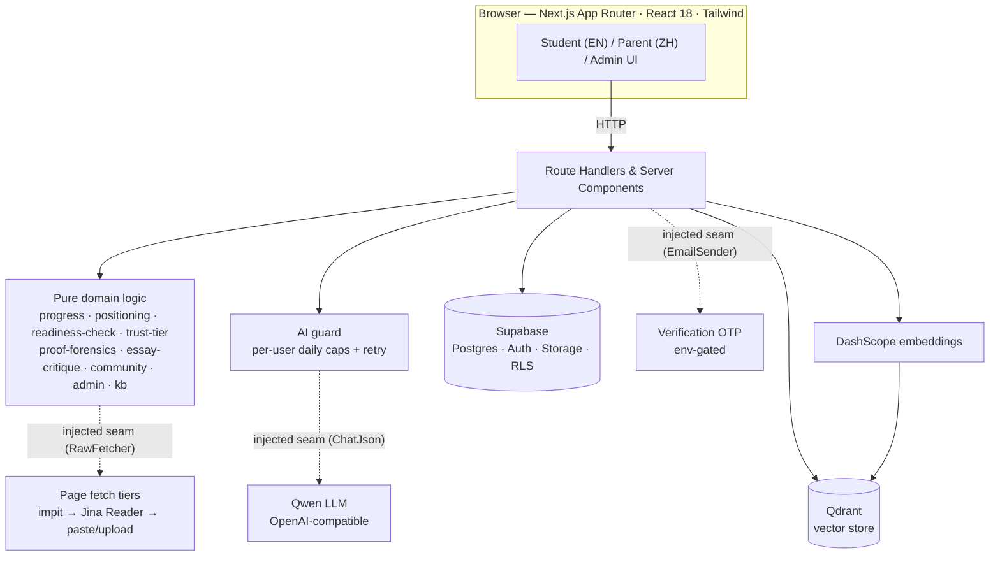
```mermaid
flowchart TD
  subgraph CLIENT["Browser — Next.js App Router · React 18 · Tailwind"]
    UI["Student (EN) / Parent (ZH) / Admin UI"]
  end

  UI -->|HTTP| RH["Route Handlers & Server Components"]
  RH --> DOMAIN["Pure domain logic<br/>progress · positioning · readiness-check · trust-tier<br/>proof-forensics · essay-critique · community · admin · kb"]

  RH --> GUARD["AI guard<br/>per-user daily caps + retry"]
  GUARD -. "injected seam (ChatJson)" .-> LLM["Qwen LLM<br/>OpenAI-compatible"]

  RH --> DB[("Supabase<br/>Postgres · Auth · Storage · RLS")]
  RH --> VEC[("Qdrant<br/>vector store")]

  DOMAIN -. "injected seam (RawFetcher)" .-> FETCH["Page fetch tiers<br/>impit → Jina Reader → paste/upload"]
  RH -. "injected seam (EmailSender)" .-> MAIL["Verification OTP<br/>env-gated"]
  RH --> EMB["DashScope embeddings"]
  EMB --> VEC
```

## **6.1 Layered Responsibilities**

* **UI layer:** React Server and Client Components under `src/app/(student|parent|admin)/`. Server Components fetch data; Client Components own local state and event handlers.

* **Route handlers:** All API endpoints under `src/app/api/`. Responsible for authentication, authorisation, input validation, orchestration, and all I/O.

* **Pure domain layer:** Business logic in `src/lib/progress.ts`, `positioning.ts`, `readiness-check.ts`, `trust-tier.ts`, `proof-forensics.ts`, `essay-critique.ts`, `ai-guard.ts`, `school-email.ts`, `progress-share.ts`, `schools.ts`, `programme-stats.ts`, and the `community/`, `admin/`, and `kb/` module trees. These modules import no `@supabase` or `openai` packages — all external access is injected.

* **Seams:** Thin injected interfaces connecting domain logic to external systems: `chatJson` (LLM), `createPageFetcher`, `sendVerificationEmail`, `createAdminClient`, `QdrantStore`, `AiUsageStore`.

* **Data layer:** Supabase Postgres (tables, constraints, RLS policies, triggers) and Qdrant (vector store). The schema is the single source of truth for persistence.

## **6.2 Example Request Lifecycle — Verifying an Admission Case**

1. The student submits a case with attached proof via `POST /api/community/reports`.
2. The route handler authenticates using `auth.getUser()` and validates the request body.
3. Each proof file is stored in a private Supabase Storage path the client cannot read directly, and hashed with SHA-256.
4. Text is extracted from each proof using `pdf-parse` or `tesseract.js` depending on file type, and PDF metadata is read for forensic signals.
5. The handler calls `createAiClaimVerifier(chatJson).verify(claim, evidence)`. The verifier receives an injected `chatJson` function and has no knowledge of Qwen or any specific provider.
6. The pure function `decideVerificationStatus(verdict)` maps the AI response to a status.
7. The pure function `applyForensicsGate(status, forensics, isDuplicate)` then applies the forensic rules: a cross-author duplicate forces `mismatch`, and suspicious metadata downgrades an automatic pass to human review. It can only lower the verdict.
8. The handler writes the case and verdict using the **service-role** client. A database trigger prevents any client-side key from setting verification columns, so a verdict cannot be spoofed.
9. If the verdict is `verified`, the anonymised case is ingested into Qdrant, feeding the knowledge base and positioning statistics.
10. Readers later see a badge derived from `decideTrustTier(...)`, which combines the verdict with the author's school-email verification and any human review.

## **6.3 Example Request Lifecycle — AI Roadmap Generation**

This illustrates the generate-preview-adopt pattern used throughout the application.

1. The student clicks Generate Roadmap; the client posts to `/api/roadmap/generate`.
2. The handler fetches the student profile and calls `getRoadmapQuota()` — a **read-only** check. If the allowance is exhausted, it returns early without contacting the model.
3. The handler performs hybrid retrieval against Qdrant using the target university and curriculum as the query, and prepends the retrieved context to the system prompt.
4. The grounded prompt goes to Qwen through `withTimeout()` (45-second cap) and `parseJson()` (safe extraction with a brace-balancing fallback).
5. `normalizeGeneratedRoadmap()` validates the envelope and coerces every row, throwing a labelled error on a missing or empty year array rather than letting malformed output reach the UI.
6. Only now, with a usable roadmap in hand, does the handler call `consumeRoadmapQuota()`. A failure at any earlier step costs the student nothing.
7. The client renders a preview modal. The student may dismiss it with no side effects.
8. On Adopt, the client posts to `/api/roadmap/save`, which atomically archives the previous roadmap and bulk-inserts the new one with its milestones.
9. `router.refresh()` reloads the server component with fresh data.

## **6.4 Registration & Parent Linking**

For a student, the signup page calls `supabase.auth.signUp()` with `role: student`, which fires
the `handle_new_user()` Postgres trigger to insert the `profiles` and `student_profiles` rows.
After email confirmation, `/auth/callback` exchanges the code for a session and redirects to
the dashboard.

For a parent, the flow starts from a six-digit invite code generated by the student. The
parent enters the code on the join page; the system validates it against `student_profiles`,
creates the account with `role: parent`, and inserts a `parent_links` row connecting parent to
student. Every parent-facing query is then scoped through that link, both in the application
and in the row-level security policies.

---

# **7. Software Engineering Practices**

Each practice below is backed by concrete evidence in the codebase, not just stated intent.

## **7.1 Branching Workflow & Version Control**

All work lands through short-lived feature branches → pull request → review → merge, with no
direct feature commits to `main`. Commit messages follow Conventional Commits —
`type(scope): subject` — with a body explaining *why* the change was made, so the history
reads as a changelog. For example: `feat(community): verified admission case library + social
layer`, `fix(roadmap): charge the free-generation credit only after success`.

Each feature was specified as a PRD, broken into tracer-bullet vertical slices, implemented
test-first, and merged via a pull request. Representative branches:
`feat/community-case-library`, `feat/admin-panel`, `ms3`. Where a long-running branch met
concurrent work on `main`, conflicts were resolved by keeping both capabilities rather than
choosing one — the calendar's week/day views and the bilingual dictionary were merged into a
single implementation.

## **7.2 SOLID Principles**

**Single Responsibility.** Each module in `src/lib/` does exactly one thing.
`positioning.ts` decides reach/match/safety. `readiness-check.ts` audits submission
readiness. `trust-tier.ts` resolves badge precedence. `proof-forensics.ts` derives evidence
signals. `community/verify.ts` decides verification verdicts, `parse.ts` extracts claim data,
`vote.ts` handles vote maths, `stats.ts` computes aggregates, `query.ts` parses filters. None
of these files touches database or LLM code.

**Open/Closed.** New strategies can be added without editing existing call sites. The
`ClaimVerifier` interface lets AI and manual verification be swapped without changing the
route handler. `applyVerificationOverride` adds admin override behaviour without modifying
core verification. `AiUsageStore` allows the quota backend to change from Postgres to
in-memory without touching `guardedAiCall`.

**Liskov Substitution.** Fakes substitute for real seams without changing the behaviour under
test. Any test needing an LLM passes a fake `chatJson`; the domain logic cannot distinguish it
from the real Qwen client. The same holds for `RawFetcher` and `AiUsageStore`.

**Interface Segregation.** Seam interfaces are as small as possible:
`ChatJson = (system: string, user: string) => Promise<unknown>`,
`RawFetcher = (url: string) => Promise<string>`, and `AiUsageStore` with two methods. Each
contains only what the domain logic needs.

**Dependency Inversion.** Domain logic depends on abstractions, never on concrete external
libraries. `lib/community/` imports no `@supabase/supabase-js` or `openai` package —
verifiable by running:

```bash
grep -rnE "^import .*(openai|@supabase)" src/lib/community/   # returns nothing
```

## **7.3 Test-Driven Development**

Pure logic is written test-first (red → green → refactor): a failing test, then the minimal
code to pass it, then cleanup. Decision cores were built this way before any UI or route
handler existed.

The following functions each have a sibling `tests/*.test.ts` written before the
implementation: `buildProgressSnapshot`, `toPublicProgressCard`, `decidePositioning`,
`checkSubmissionReadiness`, `decideTrustTier`, `assessProofForensics`, `applyForensicsGate`,
`normalizeEssayFeedback`, `guardedAiCall`, `decideCodeRequest`, `decideCodeSubmit`,
`decideShareAccess`, `decideNoticeTarget`, `filterSchools`, `sortProgrammeStats`,
`groupNavItems`, `resolveLocale`, `normalizeGeneratedRoadmap`, `decideVerificationStatus`,
`applyVote`, `computeCaseStats`, `planToProposedEvents`, `pickBestText`,
`nextModerationStatus`, `dedupeAgainstExisting`, `computeJourney`.

`npm test` executes **251 unit tests across 44 files** via Vitest, completing in a few
seconds.

Notably, several tests encode **product rules** rather than mere behaviour, so a rule cannot
regress silently:

* The Essay Studio test asserts that rewritten-prose fields are stripped from AI feedback — the no-ghostwriting guarantee.
* The positioning test forbids a "safety" verdict without outcome data.
* The share-card test asserts that no score, reasoning, or private title can appear in the public projection.
* The forensics test asserts that forensic signals can only lower a verdict, never raise one.

## **7.4 Separation of Concerns & Fail-Safe Behaviour**

* **Pure vs. I/O:** All decisions are made in pure, unit-tested functions. I/O lives only at the edges — route handlers call the database and the LLM; domain functions receive inputs as parameters and return values.

* **Graceful degradation:** Malformed LLM JSON is salvaged by `parseJson()` into a safe partial result. An unscrapeable URL falls back from `impit` to Jina Reader to manual paste/upload. A knowledge-base failure yields an answer without retrieved context rather than an error. A feature whose migration has not yet been applied renders a friendly "not enabled yet" notice instead of crashing.

* **Idempotency:** Calendar sync (`dedupeAgainstExisting`), wiki re-ingestion (`ingested_at` guard), and vote upserts are all no-ops on repeat.

* **Preview-then-commit:** AI output is always shown for review before it mutates data. The generate endpoint performs no writes; the save endpoint writes only after explicit confirmation.

* **Least privilege:** Row-Level Security scopes every row to its owner. Verification, staff-review, and AI-usage columns are writable only by the service role, enforced by database triggers — so a client cannot grant itself trust or reset its own quota.

* **Honest-by-default UI:** When a signal is absent the interface says so —  *insufficient data* — instead of synthesising a plausible number. This principle produced real deletions: two dashboards previously displayed dimension bars derived arithmetically from an unrelated score, and those were removed rather than kept as decoration.

---

# **8. Testing & Quality Assurance**

## **8.1 Test Plan — Four Layers**

**Layer 1: Unit tests on pure logic.** The primary safety net. Decision cores are tested in
isolation with no external dependencies: progress snapshots, positioning verdicts, readiness
audits, trust-tier precedence, proof forensics, essay-feedback normalisation, AI quota
accounting, school-email code policy, share-link access rules, verification thresholds, vote
transitions, positioning statistics, calendar event proposal and deduplication, fetch-tier
selection, moderation state machines, locale resolution, and navigation grouping.

**Layer 2: Seam tests with fakes.** Tests that exercise seam constructors —
`createAiClaimVerifier`, `critiqueEssay`, `parseMaterial`, `createPageFetcher`,
`guardedAiCall` — against fake LLM responses, fake fetchers, and in-memory stores. These
assert correct behaviour when the AI returns an unexpected shape, when a fetcher times out,
when extracted text is empty, and when a quota is exhausted.

**Layer 3: Route and integration coverage.** Auth gating (unauthenticated requests return
401, wrong-role requests return 403), happy and failure paths on key routes, idempotency on
repeat sync, and authorisation decisions extracted into pure functions — such as
`decideNoticeTarget`, which encodes who may write a school-communication record — so the
security decision itself is unit-testable rather than buried in a handler.

**Layer 4: Manual verification.** End-to-end flows are walked through against the seeded demo
accounts before each submission: student sign-up and onboarding; roadmap generation, preview,
and adoption; calendar creation across month, week, and day views including conflict
detection; document upload and parent sharing; school-notice translation; application-plan
generation from a URL and calendar push; essay critique; admission-case submission and AI
verification; admin moderation, override, and human review; the parent dashboard in Chinese;
progress-link generation and public viewing; and the language toggle in both directions.

## **8.2 Running the Test Suite**

```bash
npm test          # Vitest — 251 tests across 44 files
npx tsc --noEmit  # TypeScript check-only (CI gate)
npm run build     # production build — runs tsc + ESLint (merge gate)
```

## **8.3 Quality Gates**

Every change must pass a green Vitest suite, a clean `tsc --noEmit`, a successful
`npm run build`, and a manual walkthrough of any affected end-to-end flow before merging.

TypeScript strict mode is enabled throughout: no implicit `any`, strict null checks. The
production build fails on any type error, making the type checker a compile-time test suite
for structural correctness. ESLint is configured with `eslint-config-next`, layering
Next.js rules on top of `eslint:recommended`, `react-hooks`, and `jsx-a11y` accessibility
rules; the build fails on lint errors, making linting a gate rather than an optional step.

These gates are currently enforced locally before each merge rather than by a hosted CI
pipeline — an honest limitation recorded in §17.

## **8.4 Test Coverage by Module**

* **Decision cores for the agency-replacement features** (`positioning.ts`, `readiness-check.ts`, `essay-critique.ts`, `programme-stats.ts`): every exported function is unit-tested, including the product-rule assertions described in §7.3.

* **Trust and safety** (`trust-tier.ts`, `proof-forensics.ts`, `school-email.ts`, `progress-share.ts`, `notice-target.ts`): full coverage of tier precedence, forensic gating, code request/submit policy, share access rules, and the authorisation decision.

* **`lib/community/`** (verify, parse, vote, stats, query, notifications): 100% of exported functions have dedicated unit tests.

* **`lib/admin/`** (moderation, verification, contributions, access): all state-machine transitions and decision functions are unit-tested.

* **`lib/progress.ts`**: snapshot construction and the public share projection, including the privacy assertion.

* **`lib/ai-guard.ts`**: cap enforcement, single-retry semantics, transient-versus-permanent error classification, and usage accounting on success only.

* **`lib/gamification.ts`**: XP, level bands, badge unlocks, and journey stage computation.

* **`lib/application-events.ts`** and **`lib/page-fetch.ts`**: event proposal, deduplication, and all fetch-tier selection logic via seam tests with fake fetchers.

* **Route handlers:** business logic within handlers is minimal by design — they delegate to the pure domain layer, which is where the tests live.

---

# **9. Tech Stack**

Every major dependency was chosen against explicit criteria.

* **Framework: Next.js 14 with the App Router and React 18.** One codebase for both UI and API, Server Components reduce client-side JavaScript, secrets remain server-side by default, and it offers first-class Vercel deployment.

* **Language: TypeScript with strict mode.** Compile-time safety across the UI, API, database types, and seam boundaries. The production build fails on any type error.

* **Database, authentication, and storage: Supabase (PostgreSQL).** Combines Postgres, Auth, Storage, and Row-Level Security with almost no backend infrastructure code. Chosen because the data model is highly relational and Postgres RLS lets authorisation be expressed declaratively in the database rather than scattered through application code.

* **AI provider: Qwen by Alibaba DashScope via the OpenAI-compatible SDK.** Strong Chinese and English capability, an OpenAI-compatible API that allows provider swaps, cost-effectiveness at student scale, and reliable accessibility from mainland China.

* **Vector store: Qdrant with DashScope embeddings.** Powers the knowledge wiki and case-library grounding, supporting hybrid retrieval (dense semantic plus lexical sparse vectors) in a single query.

* **Page fetch: impit + Jina Reader.** `impit` uses browser fingerprinting to fetch pages behind simple bot detection; Jina Reader renders JavaScript-heavy pages. Together they cover most university admissions pages without manual paste or upload.

* **Document extraction: pdf-parse and tesseract.js.** `pdf-parse` extracts text and metadata from PDF proofs; `tesseract.js` performs OCR on image-based proof such as photographed letters.

* **UI: Tailwind CSS, Radix UI, lucide-react, recharts.** Tailwind provides consistent co-located styling with zero runtime overhead, Radix supplies accessible unstyled primitives, and Recharts handles the readiness and finance visualisations.

* **Internationalisation: a `NEXT_LOCALE` cookie with colocated per-page dictionaries.** Role-shaped defaults (student English, parent Chinese) with instant switching. See §16 for why this replaced a message-catalogue library.

* **Email: the Resend HTTP API, environment-gated.** Used for exactly one purpose — one-time school-mailbox verification codes. No SDK dependency; the integration is a single `fetch` call, and the feature reports itself unavailable when the key is absent.

* **Tests: Vitest.** Fast, ESM-native unit testing; the full suite runs in a few seconds.

* **Deployment: Vercel + Supabase Cloud.** Zero-config Next.js hosting, managed Postgres and Storage. The Vercel region is `hkg1` for latency to the target audience.

---

# **10. Design Principles**

## **1. Security by Default (Least Privilege)**

Every table has Row-Level Security enabled, with policies scoping access to the owning student
and, in read-only mode, their linked parent via a security-definer helper function. The
browser only ever holds the anon key. The service-role key is used only in server-only paths
where a privileged write is genuinely required — verification verdicts, cross-user
notifications, quota counters, and the public share page. Authentication in security-sensitive
paths uses `auth.getUser()`, which verifies the JWT with the Auth server, in preference to
`getSession()`, which only decodes a cookie locally and can be spoofed.

## **2. Separation of Concerns**

Data fetching lives in Server Components. Interactivity lives in Client Components. Reusable
business logic lives in `lib/`. The database schema is the single source of truth for
persistence. The pure domain layer imports no framework or external-service packages — it
receives everything through injected interfaces.

## **3. Fail-Safe AI**

Every model call is wrapped in `withTimeout()` with a 45-second cap and parsed through
`parseJson()`, which falls back to brace extraction and throws a labelled error the API layer
converts into a clean response. Output is then normalised and whitelisted before it can reach
the UI or the database. A flaky or slow model never crashes a request or corrupts data, and
never costs the user a quota credit.

## **4. Explicit User Intent — Preview, then Commit**

Expensive or destructive actions are never silent. The AI roadmap is previewed before Adopt
persists it. Application plans are previewed before deadlines reach the calendar. Progress
links are created explicitly and can be revoked. This keeps cost, surprise, and data mutation
under the user's control.

## **5. Mobile-First & Responsive**

The audience browses primarily on phones. Layouts use responsive Tailwind utilities and the
sidebar collapses into an off-canvas drawer on small screens. The public progress card is
designed specifically for the WeChat in-app browser at 375 px width.

## **6. Localisation as a First-Class Concern, With a User Override**

The student interface defaults to English and the parent interface to Simplified Chinese —
matching who actually uses each surface — but neither is locked. Locale is resolved from a
cookie with a role-shaped fallback, so a user's explicit choice always wins, and every page
honours it.

## **7. Single Source of Truth / DRY**

Design tokens live once in `tailwind.config.ts`. XP values live once in `XP_BY_CATEGORY`.
Application progress is computed once by `buildProgressSnapshot` and consumed by the student
dashboard, the parent dashboard, the parent roadmap header, and the public share card —
replacing four independent derivations, two of which had drifted into displaying invented
numbers. Duplicated truth is treated as a bug.

## **8. Honesty Over Polish**

Where the system does not know something, it says so. An unverified application plan is
labelled unverified. A statistic without a source renders “no data” (暂无数据). A target with insufficient
case data returns *insufficient data* rather than a confident verdict. An essay gets critique,
never ghostwriting. A trust badge states its basis rather than implying a guarantee. This is
also why several features were **deleted** during the final milestone: two directory pages
looked complete but were backed entirely by mock data with dead buttons, and a finance screen
accepted edits it silently discarded. A feature that lies is worse than a feature that is
absent.

---

# **11. Design Patterns**

## **1. Container / Presentational — Server and Client Split**

`page.tsx` files are async Server Components that fetch from Supabase and map rows into view
models, then render a Client Component owning local state and handlers — for example
`roadmap/page.tsx` → `RoadmapClient.tsx`, `portfolio/page.tsx` → `PortfolioClient.tsx`,
`essays/page.tsx` → `EssaysClient.tsx`. Data fetching stays on the server; client JavaScript
is limited to interaction logic.

## **2. Adapter**

`lib/ai.ts` instantiates the OpenAI SDK but points its `baseURL` at Alibaba's DashScope
endpoint. Because Qwen exposes an OpenAI-compatible API, the rest of the application talks to
a stable interface, and switching providers requires only a base URL and key change.

## **3. Factory**

`db/client.ts` and `db/server.ts` centralise Supabase client construction for browser, Server
Component, and Route Handler contexts, so call sites never wire cookies by hand.
`createPageFetcher({impitFetch, readerFetch})` builds a fetcher from injected tier
implementations, letting tests substitute fakes.

## **4. Strategy — Quota Policy**

Quota rules are encapsulated behind functions that route handlers call without knowing the
policy. `getRoadmapQuota`/`consumeRoadmapQuota` express the yearly freemium allowance, and
`FEATURE_DAILY_CAPS` with `guardedAiCall` expresses per-feature daily budgets. Changing an
allowance means editing one place.

## **5. Strategy — Verification Override**

`lib/admin/verification.ts` implements `applyVerificationOverride` as a strategy that can flip
a verdict independently of the AI verifier. The admin panel calls this strategy; the AI
verifier is a separate one. Both write to the same persistence layer with no knowledge of each
other.

## **6. Pure Function / Derived State**

`buildProgressSnapshot`, `decidePositioning`, `checkSubmissionReadiness`, `decideTrustTier`,
and the gamification functions are pure functions of their inputs. They are reused across
student, parent, and public surfaces and are fully unit-tested without mocking.

## **7. Projection / Data Transfer Object**

`toPublicProgressCard(snapshot)` projects the rich internal snapshot down to the narrow set of
fields safe to publish on an unauthenticated page. Privacy becomes a property of a single
pure function with a test asserting what must not survive the projection, rather than a
discipline spread across template code.

## **8. Optimistic UI with Rollback**

Milestone toggles, vote toggles, and marking a fee paid update local state immediately, write
to the database, and revert with an error toast if the write fails.

## **9. Guard Clause**

Every Route Handler begins with early returns for missing authentication, wrong role, invalid
input, or missing resources before any business logic runs, keeping the happy path at the
lowest indentation level.

## **10. Resilience Decorators**

`withTimeout()` and `parseJson()` wrap every model call with a timeout and safe parsing, and
`guardedAiCall()` adds budget enforcement and retry. These decorators compose and have no
knowledge of the business logic they protect, so a new AI feature inherits timeout, parse
safety, and cost control by calling through the established seam.

## **11. Idempotent Operations**

Calendar deduplication, wiki re-ingestion, vote upserts, and roadmap adoption
(archive-then-insert) are all safe to run repeatedly, making the system resilient to network
retries and double submits.

---

# **12. Design Decisions**

## **1. Rendering Model — React Server Components vs. SPA**

The alternatives considered were Next.js App Router with Server Components, a client-only SPA
(Vite + React) calling a separate API, and the Next.js Pages Router. Server Components offer
native server-side data fetching, minimal client JavaScript, one codebase for UI and API, and
server-side secrets by default. A client SPA would require a separate API service, ship a
large bundle, and make secret leakage easy. The Pages Router sits in the middle but lacks the
App Router's clean server defaults.

We chose React Server Components to fetch directly from Supabase on the server, keep the
service-role key and queries off the client, ship less JavaScript to phones, and avoid
maintaining a second backend service.

## **2. Backend Platform — Supabase vs. Firebase vs. Custom**

Supabase provides relational data and joins through Postgres, row-level authorisation in the
database, and bundled auth and storage with minimal backend code. Firebase's document model
fits our highly relational data poorly (students → roadmaps → milestones → parent_links) and
uses a proprietary rules language. A custom Node/Express stack offers full control at the cost
of hand-rolled authorisation and significant infrastructure work.

We chose Supabase because the data model is relational and Postgres RLS lets authorisation be
expressed declaratively in the database rather than scattered through application code — a
decision that paid off directly when parent read-access and public share pages both reduced to
policy work.

## **3. AI Provider — Qwen vs. OpenAI vs. Kimi**

All three offer strong Chinese and English capability and expose OpenAI-compatible APIs, so
integration code is identical. Qwen and Kimi are markedly more cost-effective at Orbital usage
volumes and more reliably accessible from mainland China, where the target parent users are.

We chose Qwen for its Chinese–English translation quality, cost, and regional accessibility.
Because the OpenAI SDK acts as an adapter pointed at the DashScope base URL, switching
providers is a base URL and key change.

## **4. Roadmap Persistence — Auto-Save vs. Preview-then-Adopt**

Immediate persistence is simpler but risks overwriting an existing roadmap and forces the
student to accept whatever the AI produced — a poor fit for non-deterministic, occasionally
slow generation.

We chose Preview-then-Adopt: the student controls when data is written, regeneration is free
of side effects, and overwrites are never accidental. A related refinement followed from
production behaviour: the quota credit was originally consumed *before* generation, so
transient failures silently drained a student's allowance. It is now consumed only after a
usable roadmap exists.

## **5. Family Connection Channel — Email Digest vs. In-App Dashboard and WeChat**

Our original plan was an automated weekly Chinese email digest. Email requires a verified
domain and reliable SMTP, carries spam risk, and — decisively — does not match the habits of
Chinese parents, who live in WeChat and do not expect important updates by email.

We chose the in-app dashboard plus WeChat-shareable progress links: always available, no
external service to configure, and aligned with how the audience actually communicates. The
one exception is deliberate and narrow: a single one-time verification code sent to a
university mailbox, because mailbox control is an identity signal that cannot be obtained any
other way. It is an identity check, not a channel.

## **6. Verification Architecture — AI-only vs. Human-in-the-Loop vs. Tiered Trust**

AI-only verification is fast but shallow; full human moderation is accurate but does not
scale. We first shipped a hybrid: AI verifies, admins override. Reviewing that design against
the question "could a student fake this?" exposed a real gap — AI cross-checking proves the
document *says* what the case claims, not that the document is *real*.

We therefore chose layered, visible trust: automated cross-checking, plus file-hash duplicate
detection and PDF metadata forensics, plus optional school-mailbox verification, plus human
review — each surfaced as a distinct badge tier. The product deliberately does not claim
"guaranteed genuine"; it shows *how* a case was verified and makes forgery progressively more
expensive. Honesty about the limit is part of the design (see §17).

## **7. Knowledge Base — Static Prompt vs. Live Retrieval**

A static prompt with hardcoded NUS and NTU knowledge is simpler but goes stale as requirements
change and cannot scale across programmes.

We chose live retrieval against Qdrant so admins can update knowledge without redeploying,
the AI can cite the article it retrieved, and verified community cases feed back into the
corpus automatically.

## **8. Essay Support — Ghostwriting vs. Critique-Only**

Essay help is the single largest line item at a study-abroad agency, so generating essays
would have been the most immediately impressive feature to demo. We rejected it.

Universities increasingly screen for AI-generated and ghostwritten text, so a generated essay
transfers real risk onto a minor while producing work that is not theirs. Critique, by
contrast, is what a *good* counsellor actually provides. We chose critique-only and enforced
it structurally rather than by prompt alone: the response normaliser strips any rewritten-prose
field, and a unit test asserts it. The rule cannot be softened by an accidental prompt edit.

## **9. Statistics — AI-Generated vs. Curated Official Data**

The programme comparison dashboard could have asked the model for rankings and salaries. That
would have been faster to build and would have produced plausible, confidently-worded, and
sometimes wrong numbers — precisely the failure mode that makes students distrust a tool.

We chose a curated table of official statistics with per-field provenance stored alongside
each value: source name, URL, and edition year. Where a figure could not be verified it stays
null and renders “no data” (暂无数据). Two such gaps exist in the current dataset and are shown as gaps
rather than filled by estimation.

---

# **13. Data Model & Schema**

The schema is PostgreSQL via Supabase and consists of **35 tables** organised into functional
modules: user management, academic planning, calendar and documents, community and knowledge,
trust and verification, school directory and programme statistics, parent communications and
sharing, and finance.

## **13.1 User Management**

`profiles` stores base account information: role (student, parent, or admin), display name,
optional pen name, and preferred language. `student_profiles` stores onboarding data — current
year, school, curriculum, target university and programme, target enrolment year, interests,
budget range, English level, and the invite code used to link a parent. `parent_links` manages
the parent-to-student relationship created by redeeming an invite code.

A Postgres trigger, `handle_new_user()`, creates `profiles` and `student_profiles` rows
automatically on signup, and `guard_profile_role` prevents a user from promoting their own
role.

## **13.2 Academic Planning**

`roadmaps` stores active and archived AI-generated roadmaps, and `milestones` stores the
year- and month-tagged milestones belonging to a roadmap with type, title, description, due
date, and completion status. `roadmap_generation_quota` tracks the freemium allowance per
user.

`achievements` stores portfolio entries with category, title, description, date, and XP.
`readiness_scores` stores the legacy holistic score and gap analysis, while
`portfolio_assessments` stores the structured five-dimension AI assessment as JSON.
`university_targets` stores each targeted programme together with its generated application
plan, reference link, and gap analysis.

`essays` stores the student's own drafts, optionally linked to a `university_targets` row, and
`essay_feedback` stores each round of AI critique with a snapshot of the draft it reviewed.

## **13.3 Calendar & Documents**

`calendar_events` stores all deadlines and personal events with title, date, optional start and
end times, type, source, notes, and four reminder flags. `student_documents` stores upload
metadata including file name, storage path, file type, extracted text, and AI classification.
`document_access` manages sharing grants, linking a document to a parent profile with a
permission level.

## **13.4 Community & Knowledge**

`admission_reports` stores admission cases with institution, programme, route, result, apply
year, scholarship, background fields, written experience sections, verification status and
detail, ingestion timestamp, moderation status, and vote tallies. `report_proofs` stores each
uploaded proof with its storage path, document kind, extracted text, and SHA-256 hash.
`report_votes`, `report_saves`, and `report_comments` carry the social layer, and
`notifications` delivers in-app notifications created by database triggers.
`kb_contributions` holds user-submitted pages awaiting admin review.

Verification columns are protected by the `guard_report_verification` trigger, so only the
service role can set them.

## **13.5 Trust & Verification**

`school_email_verifications` stores one row per student: the claimed university address, its
domain and resolved institution, a user-bound hash of the current code, expiry, attempt and
daily-send counters, and the verification timestamp. The table is select-only for users; all
writes go through the service role, so counters cannot be tampered with.

`admission_reports.staff_reviewed_at` records human review and is protected by the
`guard_staff_review` trigger. `ai_usage` tracks per-user, per-feature, per-day AI call counts
and is likewise select-only for users.

## **13.6 Directory, Statistics & Sharing**

`schools` is the curated directory powering the Navigator — name, slug, level, curriculum,
zone, address, description, website, indicative tuition range, and highlights — world-readable
and admin-writable.

`programme_stats` holds the official programme statistics: university, programme, country,
curriculum and grade-profile URLs, QS university and subject ranks, THE rank, GES median
salary, employment rate and survey year, plus a `sources` JSON column carrying per-field
provenance (source name, URL, year).

`progress_shares` stores parent-created share links: an unguessable token, the student and
creating parent, creation and expiry timestamps, and a revocation timestamp.

## **13.7 Parent Communications & Finance**

`school_communications` stores translated school notices with the original text, Chinese
translation, Chinese summary, and source type. `parent_drafts` stores bilingual reply drafts.
`fee_items`, `expense_logs`, and `insurance_policies` support finance tracking, with parent
read access granted by policy. `homestay_listings`, `homestay_reviews`, and `homestay_saves`
remain in the schema from an earlier iteration; the corresponding UI was removed in the final
milestone (see §17).

## **13.8 Key Relationships**

* `profiles` ↔ `student_profiles` — one-to-one.
* `profiles` ↔ `profiles` — many-to-many via `parent_links`.
* `student_profiles` → `roadmaps` → `milestones` — one-to-many chains.
* `student_profiles` → `achievements`, `calendar_events`, `university_targets`, `portfolio_assessments`, `essays`, `student_documents` — one-to-many.
* `university_targets` → `essays` — one-to-many (an essay may target a specific programme).
* `essays` → `essay_feedback` — one-to-many.
* `admission_reports` → `report_proofs`, `report_votes`, `report_saves`, `report_comments` — one-to-many.
* `student_documents` → `document_access` → `profiles` (the parent) — sharing grants.
* `profiles` (parent) → `progress_shares` → `profiles` (student) — share links.

---

# **14. Security & Privacy**

Row-Level Security is enabled on every application table. Policies scope data access to the
owning student and grant read-only access to their linked parent through a security-definer
helper function. All policies live in `supabase/` and are the authoritative source of access
control.

Authentication in security-sensitive paths uses `auth.getUser()`, which verifies the JWT with
the Supabase Auth server, in preference to `getSession()`, which only decodes a cookie locally
and can be spoofed.

The application follows a least-privilege key model. The browser holds only the anon key. The
service-role key, which bypasses RLS, is server-only and used in audited paths where a
privileged operation is genuinely required: writing verification verdicts, marking human
review, incrementing AI usage counters, creating notifications addressed to another user, and
rendering the public progress card. Database triggers provide defence in depth — even with a
service-role bug, a client key cannot set `verification_status`, `verified_at`,
`staff_reviewed_at`, or its own `role`.

Two authorisation weaknesses found during the final milestone's own review were fixed rather
than deferred. The school-notice translation endpoint previously wrote via the service role to
a student identifier supplied in the request body, allowing any authenticated user to plant a
record against any student; the target is now derived from the session through a pure,
unit-tested decision function. Separately, the `document_access` table had RLS disabled with
the intent that the application would police it; because Supabase grants the `authenticated`
role table access by default, the parent-document ACL was effectively open. RLS is now enabled
with explicit owner and grantee policies.

All API handlers validate input shape before processing. File uploads enforce a 10 MB cap and
a MIME allowlist. Profile updates use a field whitelist to prevent mass assignment. Resource
ownership is confirmed at the point of access. Every AI-backed endpoint runs under a per-user
daily cap so a compromised or abusive account cannot generate unbounded cost.

Secrets live in environment variables in `.env.local`, which is git-ignored; no secrets are
committed. Student data is scoped per account and never shared beyond the explicitly linked
parent, in alignment with PDPA principles. Proof documents are stored in a private Storage
bucket and are never reachable by public URL.

Public progress sharing was designed against the same standard. The link is unguessable
(128 bits of randomness), expires after seven days, and is revocable. What it reveals is
constrained by a pure projection function — coarse statuses, counts, stage, and readiness
level only — with a unit test asserting that scores, reasoning, document titles, and finances
cannot appear. The page is marked `noindex`.

---

# **15. Internationalisation**

Both interfaces are fully bilingual. The student interface defaults to English and the parent
interface to Simplified Chinese (zh-CN), which is a hard product requirement given that target
parent users are primarily located in mainland China. Neither default is a lock: a
`NEXT_LOCALE` cookie holds the user's explicit choice, resolved by a pure `resolveLocale`
function against a role-shaped fallback, and the language toggle in the account menu switches
the entire application immediately.

Copy is stored in a `{ en, zh }` dictionary colocated in the file that renders it, so a page
and its translations are always edited together and a missing translation is a type error
rather than a runtime fallback. This replaced an earlier message-catalogue approach
(`next-intl` with `messages/*.json`), which had produced a real failure mode: the catalogues
existed and the library was configured, but the parent portal had been written with hardcoded
Chinese strings and the language toggle did nothing at all. Moving copy next to its markup
made the gap between "translated" and "actually switchable" impossible to hide, and the
switch now demonstrably works in both directions.

Locale-aware formatting follows the same resolution: dates render through `zh-CN` or `en-SG`
as appropriate. Parent surfaces use a dedicated Noto Sans SC font stack via the `font-cn`
design token. Domain terms that the Chinese-speaking community uses natively — case library (案例库), bookmark (收藏),
upvote/downvote (顶/踩), verified (已验证) — are kept in Chinese in both locales rather than translated into unfamiliar
English equivalents.

The school-notice translation feature uses Qwen's bilingual capability to produce a full
Simplified Chinese translation, a two-sentence Chinese summary, and category and urgency
assessments, storing all fields alongside the original so the parent can read both.

---

# **16. Project Structure & File Organisation**

Files are organised by responsibility and route, following Next.js App Router conventions.
Route groups in parentheses such as `(auth)` and `(student)` organise pages without adding URL
segments.

## **16.1 Directory Overview**

```
src/
  app/
    (auth)/           login, signup, parent join-by-code, auth callback
    (student)/        dashboard, roadmap, portfolio, universities, essays,
                      navigator, documents, calendar, finance, community, wiki,
                      onboarding, verify-school-email
    parent/           Simplified-Chinese parent portal: dashboard, roadmap,
                      universities, finance, comms
    share/            public, no-auth tokenised progress card
    admin/            moderation, verification, kb, directory, users
    api/              Route Handlers, organised by resource and action
  lib/
    progress.ts          the application-progress (申请进度) snapshot every progress surface renders from
    positioning.ts       reach / match / safety verdicts
    readiness-check.ts   pre-submission audit
    essay-critique.ts    feedback-only essay critique
    trust-tier.ts        case trust-tier precedence
    proof-forensics.ts   evidence hashing + PDF metadata signals
    school-email.ts      school-mailbox OTP policy
    progress-share.ts    share-link access rules
    programme-stats.ts   official-statistics sorting + provenance
    ai-guard.ts          per-user AI budgets + retry
    locale.ts            cookie locale resolution
    community/           pure domain: verify, parse, vote, stats, query, notifications
    admin/               pure domain: moderation, verification, contributions, access
    kb/                  retrieval, chunking, embeddings, Qdrant store seam
  types/              hand-written DB and domain types
supabase/             baseline schema, RLS policies, migrations, seed
scripts/              demo-user seeding, KB ingest / refresh / staleness
tests/                Vitest unit and seam tests (251 tests, 44 files)
public/screenshots/   README illustrations
playbook/             user-facing illustrated documentation
```

## **16.2 Key Conventions**

* `page.tsx` files are async Server Components; their interactive children carry a `Client` suffix (`RoadmapClient.tsx`, `EssaysClient.tsx`).
* API handlers live at `app/api/resource/action/route.ts`.
* Cross-cutting, framework-agnostic logic lives in `lib/`, never in components or route handlers.
* Pure decision modules take their inputs as parameters — including `today` as an injected date — so they never read clocks or environment and are trivially testable.
* The path alias `@/*` maps to `src/*`.
* SQL migrations are timestamped; post-baseline migrations use idempotent forms (`ADD COLUMN IF NOT EXISTS`).
* Comments explain *why*, not *what* — reserved for intent and rationale the code cannot express.

## **16.3 Local Setup**

```bash
git clone https://github.com/Kairon-2005/novara-orbital.git
cd novara-orbital
npm install
cp .env.example .env.local     # then fill in the values

supabase db reset --linked     # baseline → policies → migrations → seed
npx tsx scripts/seed-demo-users.ts   # demo students, parent, and share link

npm run dev                    # http://localhost:3000
```

| Variable | Purpose |
| --- | --- |
| `NEXT_PUBLIC_SUPABASE_URL` / `NEXT_PUBLIC_SUPABASE_ANON_KEY` | Supabase client |
| `SUPABASE_SERVICE_ROLE_KEY` | Server-only privileged writes |
| `QWEN_API_KEY` | LLM + embeddings |
| `QDRANT_URL` / `QDRANT_API_KEY` | Vector store (optional; KB features no-op without it) |
| `READER_ENABLED` | `1` to enable the Jina Reader fetch tier |
| `RESEND_API_KEY` / `VERIFY_EMAIL_FROM` | School-email verification codes (optional) |
| `NEXT_PUBLIC_WECHAT_SHARE_ENABLED` | `1` to show native WeChat share buttons |

Note that the `supabase/` directory and the internal `docs/` folder are git-ignored, so the
schema and the milestone PRDs live alongside the operator rather than in the repository.
Every feature added after the schema baseline fails soft until its migration is applied,
rendering a "not enabled yet" notice instead of an error.

---

# **17. Scope & Known Limitations**

Stated plainly, because a tool that overclaims is worse than one that admits its edges — the
same standard the product applies to its own AI output.

* **Grounding is Singapore-deep, not global.** Only NUS and NTU answers are knowledge-base verified; other universities receive model knowledge explicitly labelled *unverified*. The programme dashboard covers Singapore pairs, currency is SGD throughout, and the roadmap prompt assumes the Singapore exam calendar. Supporting another country is a data and prompt problem with a clear shape, but it is not done.

* **Verification raises the cost of faking; it does not prove identity.** AI cross-checking confirms the proof supports the claim, forensics catch reuse and obvious tampering, school-email verification proves mailbox control, and human review puts a person behind the badge. A determined forger with a convincing document and a genuine school mailbox can still pass. This is why trust is displayed as a tier with its basis rather than as a guarantee, and why cryptographically verifiable credentials such as OpenCerts — which NUS and NTU already issue — would be the natural next tier.

* **Essay critique is deliberately not authorship.** A student who wants an essay written for them is not served, by design.

* **The schema is managed outside version control.** `supabase/` is git-ignored and applied by the operator, so schema history lives with the deployment rather than in the repository.

* **Cross-curriculum positioning is count- and rate-based.** Verdicts compare outcomes and offer rates; they do not normalise IB, A-Level, and GPA onto a single numeric percentile, so a verdict is a calibrated signal rather than a probability.

* **Quality gates run locally, not in CI.** Type-check, tests, and build are green before every merge, but no hosted pipeline enforces it, so the guarantee depends on developer discipline.

* **The case feed is unpaginated**, capped at 300 rows with statistics computed in memory — comfortable at current data volumes, not at scale.

* **Two directory features were removed rather than finished.** A school-and-homestay browser and a student homestay finder were built as UI over mock data with non-functional actions. The Navigator was rebuilt on a real curated table; the homestay finder was deleted, and its tables remain in the schema unused.

* **Automated testing stops at the domain layer.** There is no browser-level end-to-end suite; interface flows are verified manually against the demo accounts.

---

*Novara — built for NUS Orbital 2026 by Team Cyber Grape. See the **[User Playbook](playbook/index.html)** for the full illustrated feature walkthrough.*
