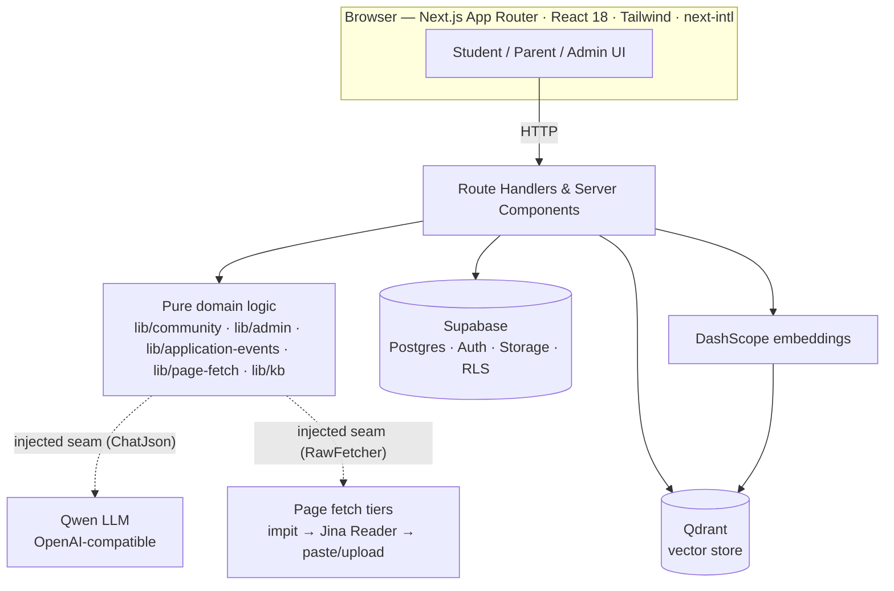

# Novara — Your Singapore Education Journey, Guided

> A bilingual web platform that helps young Chinese international students navigate
> Singapore's education system — from choosing a school to building a university-ready
> portfolio and learning from **verified** admission outcomes — while keeping their
> parents in China informed in Mandarin.

**Team:** Cyber Grape · **Programme:** NUS Orbital 2026 · **Level:** Apollo 11

### 📖 [Read the User Playbook →](playbook/index.html)

A full, illustrated walkthrough of every feature (white/blue, Claude-docs style). Open
`playbook/index.html` locally, or once GitHub Pages is enabled:
`https://kairon-2005.github.io/novara-orbital/`.

---

## Table of Contents

1. [Overview](#1-overview)
2. [Features](#2-features)
3. [System Architecture](#3-system-architecture)
4. [Software Engineering Practices](#4-software-engineering-practices) — *with evidence*
5. [Testing & Quality Assurance](#5-testing--quality-assurance)
6. [Tech Stack](#6-tech-stack)
7. [Getting Started (Local Setup)](#7-getting-started-local-setup)
8. [Project Structure](#8-project-structure)
9. [Delivery Timeline](#9-delivery-timeline)
10. [Limitations & Future Work](#10-limitations--future-work)

---

## 1. Overview

Young Chinese students who move to Singapore alone face a fragmented, high-stakes
process: choosing schools, hitting application deadlines, building a competitive
profile, and managing daily life — while their parents, back in China and often
non-English-speaking, are left in the dark.

**Novara** unifies this into one guided loop — **plan → build → apply → track** —
backed by AI that is *grounded in official sources and real, verified outcomes*, with a
read-only Simplified-Chinese portal for parents.

| Audience | What they get |
| --- | --- |
| **Students** | AI roadmap, calendar, portfolio assessment, application assistant, verified case library |
| **Parents** | Read-only progress + school-notice translation, in Simplified Chinese |
| **Admins** | Moderation, AI-verification oversight, knowledge-base & directory curation |

---

## 2. Features

- **AI Roadmap** — a personalised multi-year plan (exams, competitions, applications), KB-grounded for NUS/NTU, with a *preview-then-adopt* flow.
- **Calendar** — one master timeline; events from the AI, finance, and manual entry; reminders; `.ics` export.
- **Portfolio** — achievements + XP and a dimension-based AI assessment of strengths/gaps vs. a target.
- **Universities & Application Assistant** — per-target gap analysis and a structured application plan. **New:** build a plan from an official page by **link / paste / upload**, then push deadlines to the calendar (idempotent).
- **Admission Case Library** *(community)* — **verified** admission outcomes (一亩三分地-style). Upload proof → AI cross-checks it → only matching cases earn a ✅ badge, feed the wiki, and count in positioning stats. Votes (顶/踩), saves, in-app notifications, optional pen names, WeChat sharing — anonymous by default.
- **Knowledge Wiki** — curated, searchable NUS/NTU corpus (hybrid retrieval); the same source the AI cites.
- **Admin Panel** — `role:admin` control room: moderation queue, verification override, KB + user-contribution review, directory CRUD, user/role management.
- **Parent Portal** — read-only journey view + school-notice translate-and-reply, all in Simplified Chinese.
- Plus **School Navigator**, **Documents** (AI extraction/classification), **Finance**, and **Homestay**.

> Full step-by-step usage for each is in the **[User Playbook](playbook/index.html)**.

---

## 3. System Architecture

A Next.js App Router monolith with a strict **pure-core / injected-I/O** seam: route
handlers and server components orchestrate, *pure domain logic* makes the decisions, and
all external systems (LLM, DB, vector store, web fetch) sit behind injected interfaces.



**Layered responsibilities**

| Layer | Responsibility | Examples |
| --- | --- | --- |
| **UI** | Render + capture intent | `src/app/(student|parent|admin)/**` |
| **Route handlers** | Auth, orchestration, I/O | `src/app/api/**` |
| **Pure domain** | Decisions, no I/O | `lib/community/{verify,vote,stats,query}.ts`, `lib/application-events.ts`, `lib/admin/*` |
| **Seams** | Injected external systems | `chatJson` (LLM), `createPageFetcher`, `createAdminClient`, `QdrantStore` |
| **Data** | Persistence + access rules | Supabase Postgres, row-level security, Qdrant |

**Example request lifecycle — verifying an admission case:**
`POST /api/community/reports` → store proof privately (Supabase Storage) → extract text →
`createAiClaimVerifier(chatJson).verify(claim, evidence)` → `decideVerificationStatus(verdict)`
(pure) → persist with the **service role** (a DB trigger blocks clients from setting
verification fields) → if `verified`, ingest the anonymized case into Qdrant.

---

## 4. Software Engineering Practices

Each practice below is backed by **concrete evidence in the codebase**, not just intent.

### 4.1 Branching workflow & version control

Work lands through short-lived **feature branches → pull request → review → merge**, never
direct commits to `main`. Commits follow **Conventional Commits** (`type(scope): subject`)
with co-authorship trailers, so history reads as a changelog.

> *Evidence:* branches `feat/community-case-library`, `feat/admin-panel`; commits like
> `feat(community): verified admission case library + social layer`,
> `chore(i18n): drop wellness nav strings`. Each feature was specced (PRD) → broken into
> tracer-bullet issues → implemented test-first → merged via PR.

### 4.2 SOLID

| Principle | How we apply it | Evidence |
| --- | --- | --- |
| **S**ingle responsibility | Each domain module does exactly one thing | `lib/community/verify.ts` (verdict), `parse.ts` (extraction), `vote.ts` (vote math), `stats.ts` (aggregation), `query.ts` (filter parsing) |
| **O**pen/closed | New strategies without editing call sites | `ClaimVerifier` interface — swap AI ↔ manual verification; `applyVerificationOverride` strategy in `lib/admin/verification.ts` |
| **L**iskov | Fakes substitute for real seams in tests | tests pass a fake `ChatJson` / `RawFetcher` anywhere the real one is used |
| **I**nterface segregation | Tiny, purpose-built interfaces | `ChatJson = (system,user) => Promise<unknown>`, `RawFetcher = (url) => Promise<string>` |
| **D**ependency inversion | Domain depends on abstractions, never concretes | `createAiClaimVerifier(chat)`, `createPageFetcher({impitFetch, readerFetch})`, `createAdminClient` injected; **`lib/community/*` imports no `openai`/`@supabase`** |

> *Verify DIP yourself:* `grep -rn "openai\|@supabase" src/lib/community/` returns nothing —
> all external access is injected.

### 4.3 Test-Driven Development

Pure logic is written **test-first (red → green → refactor)**: a failing test, the minimal
code to pass, then cleanup. Decision cores were built this way before any UI or route.

> *Evidence:* `decideVerificationStatus`, `applyVote`, `computeCaseStats`,
> `planToProposedEvents`, `pickBestText`, `nextModerationStatus` each have a sibling
> `tests/*.test.ts` written first. `npm test` runs **168 unit tests** across 30 files.

### 4.4 Separation of concerns & fail-safe behaviour

- **Pure vs. I/O** — decisions are pure and unit-tested; I/O lives only at the edges (routes + seams).
- **Graceful degradation** — junk LLM JSON → a safe partial result (never a crash); an unscrapeable URL → "paste/upload" fallback; KB search failure → answer without context.
- **Idempotency** — re-syncing calendar events (`dedupeAgainstExisting`), re-ingesting the wiki (`ingested_at` guard), and vote upserts are all no-ops on repeat.
- **Preview-then-commit** — AI output (roadmaps, plans) is shown for review before it mutates data.
- **Least privilege** — Supabase row-level security scopes every row to its owner; verification columns are writable only by the service role (enforced by a DB trigger).

---

## 5. Testing & Quality Assurance

**Test plan — four layers:**

1. **Unit (pure logic)** — the decision cores (verification thresholds, vote transitions, positioning stats, event proposal, fetch-tier selection, moderation/verification transitions). *Primary safety net; TDD-first.*
2. **Seam tests with fakes** — `AiClaimVerifier`, `parseMaterial`, `createPageFetcher` against fake LLM/fetchers — asserts robustness to bad input.
3. **Route / integration** — auth gating (401/403), happy + failure paths, idempotency.
4. **Manual verification** — end-to-end flows against a seeded demo account.

**Run it:**

```bash
npm test          # vitest — 168 tests / 30 files
npx tsc --noEmit  # type-check (CI gate)
npm run build     # production build (CI gate)
```

Every change is gated on a green suite + clean type-check + successful build before merge.

---

## 6. Tech Stack

| Area | Choice | Why |
| --- | --- | --- |
| Framework | **Next.js 14** (App Router) + React 18 | One codebase for UI + API; server components keep secrets server-side |
| Language | **TypeScript** (strict) | Type safety across the seam boundaries |
| Data | **Supabase** (Postgres, Auth, Storage, RLS) | Managed Postgres with row-level security as the access-control backbone |
| AI | **Qwen** via the OpenAI-compatible SDK | Strong Chinese/English; swappable behind the `ChatJson` seam |
| Retrieval | **Qdrant** + DashScope embeddings | Hybrid (semantic + lexical) KB search |
| Page fetch | **impit** + Jina Reader | Browser-fingerprinted + JS-rendering fallback for unscrapeable pages |
| Extraction | **pdf-parse**, **tesseract.js** | Read proof/material PDFs and images |
| UI | Tailwind, Radix, lucide, recharts | Accessible primitives + charts |
| i18n | **next-intl** | First-class English / Simplified Chinese |
| Tests | **Vitest** | Fast unit + seam tests |

---

## 7. Getting Started (Local Setup)

### Prerequisites
- Node.js 20+
- A Supabase project (or the Supabase CLI for local dev)
- API keys: Qwen (DashScope); optionally Qdrant (KB features no-op without it)

### Install & configure
```bash
git clone https://github.com/Kairon-2005/novara-orbital.git
cd novara-orbital
npm install
cp .env.example .env.local   # then fill in the values below
```

Key environment variables (see `.env.example` for the full list):

| Variable | Purpose |
| --- | --- |
| `NEXT_PUBLIC_SUPABASE_URL` / `NEXT_PUBLIC_SUPABASE_ANON_KEY` | Supabase client |
| `SUPABASE_SERVICE_ROLE_KEY` | Server-only privileged writes (verification, notifications) |
| `QWEN_API_KEY` | LLM + embeddings |
| `QDRANT_URL` / `QDRANT_API_KEY` | Vector store (optional) |
| `READER_ENABLED` | `1` to enable the Jina Reader fetch tier |
| `NEXT_PUBLIC_WECHAT_SHARE_ENABLED` | `1` to show native WeChat share buttons |

### Database
The schema is a single clean baseline + RLS policies + seed under `supabase/`. Apply it to a
fresh database:
```bash
supabase db reset   # applies baseline + policies + seed
```

### Run
```bash
npm run dev     # http://localhost:3000
npm run build && npm start   # production
```

---

## 8. Project Structure

```
src/
  app/
    (student)/        student pages (dashboard, roadmap, community, universities, …)
    parent/           read-only Simplified-Chinese parent portal
    admin/            role:admin panel (moderation, verification, kb, directory, users)
    api/              route handlers (orchestration + I/O)
  lib/
    community/        pure domain: verify, parse, vote, stats, query, notifications
    admin/            pure domain: moderation, verification, contributions, access
    kb/               retrieval, chunking, embeddings, store seam
    application-events.ts, page-fetch.ts, community-reports.ts, ai.ts
  types/              hand-written DB + domain types
supabase/             single-baseline schema, RLS policies, seed (managed separately)
tests/                vitest unit + seam tests
playbook/             the user playbook (this repo's user-facing docs)
```

---

## 9. Delivery Timeline

| Phase | Scope |
| --- | --- |
| **Foundation** | Auth, onboarding, dashboard, AI roadmap, calendar |
| **Profile & apply** | Portfolio assessment, documents, universities + application assistant, knowledge wiki |
| **Family & community** | Parent portal + translation; verified admission case library + social layer |
| **Operations** | Source-grounded plans → calendar; `role:admin` panel; single-baseline schema regen |

> Each phase shipped as PRD → issues → TDD implementation on its own feature branch.

---

## 10. Limitations & Future Work

- **Schema is managed outside git** (applied via `supabase db reset`); a tracked migration history is a future improvement.
- **Verification** is an AI evidence cross-check (does the proof support the claim), not identity verification.
- **Cross-curriculum positioning** is count/rate-based; numeric percentile normalisation (IB↔A-Level↔GPA) is future work.
- **Public sharing** of cases is currently auth-gated; a truly public, anonymised view is a follow-up.
- Planned: an admin **audit log**, deadline-drift watching for KB sources, and real screenshots in the playbook.

---

*Novara — built for NUS Orbital 2026. See the **[User Playbook](playbook/index.html)** for the full feature walkthrough.*
